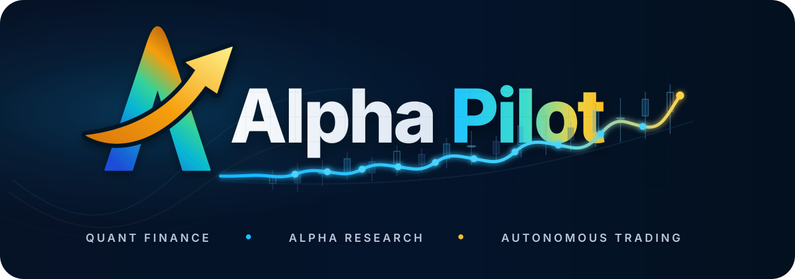

<div align="center">



### LLM-Driven Quantitative Research, Paper Trading & Live Execution Platform

[中文](README.md)&nbsp;|&nbsp;[English](README_en.md)

`Multi-Agent Factor Mining`&nbsp;·&nbsp;`Qlib Backtesting`&nbsp;·&nbsp;`Quantitative Timing`&nbsp;·&nbsp;`Paper / Live Trading`&nbsp;·&nbsp;`Web Portal`&nbsp;·&nbsp;`Telegram / Feishu Notifications`

<p>
  
  
  
  
</p>

[快速开始](#-快速开始)&nbsp;·&nbsp;[自定义策略](#-自定义策略教程)&nbsp;·&nbsp;[核心功能](#核心功能)&nbsp;·&nbsp;[典型工作流](#-典型工作流)&nbsp;·&nbsp;[文档](#-更多文档)&nbsp;·&nbsp;[Docker 部署](docs/DOCKER.md)

</div>

---

## 项目简介

AlphaPilot is an equity-focused quantitative research and trading platform covering data preparation, factor generation, backtesting & evaluation, strategy archiving, daily signals, paper trading, and live execution. The project utilizes an LLM-driven multi-agent factor research workflow, employs Qlib for backtesting and signal validation, and integrates research signals into risk control, order management, broker gateways, and audit ledgers via a unified Live Runtime. The Web Portal centralizes management of data, tasks, research assets, notifications, and trading status.

## 核心功能

| Capability | Key Command | Description |
|------|----------|------|
| Factor Mining | `alphapilot mine` | LLM multi-agent workflow + AlphaForge / GP / RL / AFF formulaic methods |
| Backtest & Evaluation | `alphapilot backtest` | Portfolio backtesting, per-factor IC fast screening, leaderboards, and equity curves |
| Strategy Creation | `alphapilot strategy_create` | Select factors from the library to archive into strategy assets (factor + model + rebalancing/cost/dates) |
| Strategy Re-backtest | `alphapilot strategy_backtest` | Reuse archived strategy assets and models for continued validation |
| Daily Signals | `alphapilot daily_signals` | Advance positions by trading day, generate single-day rebalancing signals |
| Trading Session | `alphapilot trade_session_create` | Snapshot a strategy into a recoverable, independent daily trading account |
| Custom Signal Strategy | `strategies/*/strategy.toml` | Extend signal logic with local Python strategies and explicit manifests, then unify preview, replay, and deployment |
| Quantitative Timing | `alphapilot trading_instance_create` / `trading_backtest` | Complete technical indicator signal preview, unified replay, and controlled deployment via formal strategy instances; legacy `timing_*` entry points removed in v0.2.0 |
| Paper / Live Trading | `alphapilot live_*` | `dry_run` / `paper` / `simulation` / `shadow` / `live` run modes, unified risk control & OMS, daemon, recovery reconciliation, and audit ledger; XTP Pro / EMT live trading and OpenCTP TTS counter simulation integrated via optional plugins |
| Unified Portal | `alphapilot portal` | Centralize data, factors, backtests, timing, tasks, notifications, and live trading controls into a single interface |
| Data Preparation | `alphapilot prepare_data` | baostock / tushare → Qlib data pipeline |
| Notifications & Remote | `alphapilot notify_commands` | Task completion push (Telegram / Feishu / Email) + chat command remote initiation and task querying |

### 因子挖掘

AlphaPilot's core capability is automated factor research. You can kick off an LLM-driven multi-agent mining workflow using natural language, or use formulaic methods within the same project to generate candidate factors, then unify them for validation, backtesting, and asset archiving.

- Unified management of the Idea Agent, Factor Agent, and Eval Agent three-stage research workflow
- Supports `alphapilot mine` to launch LLM-driven factor mining
- Supports formulaic mining methods like GP, RL, and AFF
- Factors can be stored in the factor library and proceed to backtesting or strategy asset management

Key entry: `alphapilot mine --direction "Your Market Hypothesis"`

<div align="center">
  
  <br><br>
  
</div>

### 回测与评估

The project includes multiple backtesting and evaluation modes, supporting both formal portfolio backtests and rapid screening of large factor candidates. The homepage retains only the most common entry points; see [CLI Command Reference](docs/alphapilot-cli.md) for additional backtest commands and parameters.

- `multi_combined`: Multi-factor merged training and portfolio backtesting
- `single_ic`: Rapid per-factor IC, RankIC, ICIR calculation
- `multi_sequential`: Run complete portfolio backtests per factor
- Portal "Backtest" page unified visualization: equity / alpha / account / turnover curves, daily breakdown, factor leaderboards, and benchmark comparisons

Key entry: `alphapilot backtest --factor_path /path/to/factors.csv`

<div align="center">
  
</div>

### 策略复测与日频信号

Once you have archived strategy assets, you can directly reuse existing factors and models for continued validation without re-running the full mining workflow. For day-by-day research or paper trading scenarios, you can also generate single-day rebalancing signals based on existing strategies.

- `strategy_backtest` supports re-backtesting saved strategy assets
- `daily_signals` supports advancing position states by specified trading dates
- `trade_session_create` / `trade_session_show` / `trade_session_history` manage independent daily trading sessions, holding their own strategy snapshots, position states, and history
- Ideal for model reuse, strategy re-validation, and single-day rebalancing drills
- Results can flow back into strategy assets and the portal for unified viewing

Key entry: `alphapilot strategy_backtest --strategy_name "<Strategy Name>" --mode=retrain`

### 模拟盘与实盘交易

The live trading system routes target positions or timing signals generated by research into a unified execution chain: `LiveRuntime → LiveEngine → RiskGate → BrokerGateway`. The underlying `dry_run` mode never routes orders; strategy instance deployment can use `paper`, `simulation`, `shadow`, or `live`. SHADOW reads real accounts and live quotes but never routes orders; LIVE must also explicitly enable environment switches and complete startup reconciliation.

- Supports `dry_run`, `paper`, `simulation`, `shadow`, `live` run modes, plus foreground and long-running daemon execution
- Supports manual orders, cancellations, and target portfolio submissions; automated strategies can only be launched via persisted strategy instances and `trading_*` deployment controls
- All orders pass unified checks for trading hours, round lots, price limits, capital, positions, concentration, single-order limits, and daily cumulative limits
- Maintains OMS state, append-only audit ledger, runtime snapshots, and recovery reconciliation; broker disconnects trigger a halt, requiring manual verification before resuming
- XTP Pro, EMT, and OpenCTP TTS integrations are decoupled from the core into installable/uninstallable pip plugins; trading channels and quote sources can be configured separately
- During daemon runtime, up to 50 observer symbols can be added incrementally via Portal or CLI without reconnecting; observer quotes are for display, K-lines, and recording only, and do not enter strategy decisions
- Portal "Live Trading" page provides preflight checks, connections, daemon operations, dynamic quote subscriptions, strategy instance deployment, risk status, and order/ledger queries

The safest experience path starts with a paper daemon:

```bash
alphapilot live_daemon_start --mode paper --symbols 600000,000001 --cash 100000
alphapilot live_daemon_subscribe --symbols 600519.SSE,510300.SSE --wait=True
alphapilot live_daemon_status --mode paper
alphapilot live_daemon_stop --mode paper
```

The `symbols` in startup parameters and later-added symbols belong to the independent daemon's `observer_symbols`. Strategy instance deployment places the instance universe into `strategy_symbols`, while extra viewing symbols remain in `observer`; the compatible field `subscribed_symbols` is the union of both. `added` only indicates the quote SDK accepted the request; if symbols still appear in `awaiting_first_tick`, continue waiting for the first Tick. Stopping the daemon clears active observers, but recorded Ticks/K-lines are not deleted.

> **Live Trading Risk Warning:** This feature is still under active development and broker environment validation. Before connecting real accounts, complete paper drills, plugin & network preflight checks, small-amount counter tests, and verify risk limits and recovery results step-by-step. Do not enable real routing without fully understanding `--confirm_live`, daemon status, and the ledger.

Detailed installation, environment variables, and acceptance workflows are in [XTP Pro / EMT Live Integration](docs/live-xtp.md), [OpenCTP TTS Counter Simulation Integration](docs/tts-simulation.md), and [Live Plugin Development & Installation](docs/live-plugins.md).

### 统一 Web 门户

AlphaPilot provides a unified Web Portal as the daily research and operational entry point, centralizing data, factors, backtests, timing, tasks, notifications, and live trading controls into a single interface to avoid switching between multiple independent scripts and pages.

- Unified access to factor mining, backtesting, timing, strategy library, market data, notification configuration, and live trading status
- Supports background tasks, scheduled tasks, and result viewing
- "Backtest" page built-in full visualization: cumulative equity / alpha / account / turnover charts, date range filtering, daily breakdown, factor leaderboards, and benchmark comparisons
- "Live Trading" page distinguishes between live / counter simulation / local paper workspaces, providing preflight, daemon, strategy, risk, and audit control planes
- Portal trading write endpoints require an operator token by default; can be switched to a high-risk `optional` mode via local CLI for read-only display of current security status
- Suitable for local research environments and server deployment scenarios

Key entry: `alphapilot portal`

<div align="center">
  
</div>

### 数据准备与管理

The project includes a built-in A-share data preparation workflow, from raw quote preparation to Qlib data; factor h5 cache is automatically generated on demand by research and backtest tasks. The homepage retains only the shortest path; download sources, adjustment modes, and advanced parameters are in the detailed documentation.

- Supports baostock and tushare data sources
- Supports quote downloading, forward/backward adjustment, and Qlib conversion
- Supports stock pool management and single-stock data maintenance
- Directly connects with factor mining, backtesting, and daily signals

Key entry: `alphapilot prepare_data download --stock_csv important_data/stock_lists/main_stock_2026_4_27.csv`

<div align="center">
  
</div>

### 通知与远程控制

Research tasks often take a long time. AlphaPilot includes a task notification and bidirectional chat command system: background tasks will proactively push results upon completion, and you can directly initiate, query, and manage tasks remotely via chat tools without staying at the terminal.

- Supports **Telegram, Feishu, and Email** notification channels
- Auto-push results and status upon task completion (or all tasks)
- Telegram / Feishu command receiver supporting `/mine`, `/backtest`, `/data`, `/status`, `/jobs`, `/cancel`, `/log`, `/result`, etc.
- Whitelist user authentication, remote task initiation, log/artifact/status viewing
- Credentials configured on the Portal "Notifications" page or injected via `ALPHAPILOT_NOTIFY_*` environment variables

Key entry: `alphapilot notify_commands --channel telegram`

<div align="center">
  
</div>

## 🚀 快速开始

The following workflow focuses on local installation, aiming to quickly complete the shortest closed loop. For **Docker one-click deployment**, see [docs/DOCKER.md](docs/DOCKER.md).

### 1. 创建环境

```bash
conda create -n alphapilot python=3.11
conda activate alphapilot
```

### 2. 安装项目

```bash
git clone https://github.com/ai-yang/AlphaPilot.git
cd AlphaPilot
pip install -e .
```

If you need the Web Portal frontend, additionally prepare Node.js and build the frontend assets under `alphapilot/modules/portal/web`:

```bash
cd alphapilot/modules/portal/web
npm install
npm run build
cd ../../../../
```

### 3. 配置环境变量

```bash
cp .env.example .env
```

Fill in at least the following configuration:

```env
OPENAI_API_KEY=<your_api_key>
OPENAI_BASE_URL=<your_api_base_url>
CHAT_MODEL=<your_chat_model>
REASONING_MODEL=<your_reasoning_model>
```

API key filling instructions:

- `OPENAI_API_KEY` should be filled with the key issued by your actual model provider.
- If using the official OpenAI API, `OPENAI_BASE_URL` is generally `https://api.openai.com/v1`.
- If using Azure OpenAI or other OpenAI-compatible gateways, replace both `OPENAI_BASE_URL` and `OPENAI_API_KEY` with values from the same platform; do not mix keys and base URLs from different platforms.
- `CHAT_MODEL` and `REASONING_MODEL` must also be filled with valid model IDs available under the current `OPENAI_BASE_URL`.
- Fill raw strings directly in `.env`; do not commit real keys to the repository.

### 4. 准备数据

```bash
alphapilot prepare_data download \
  --stock_csv important_data/stock_lists/main_stock_2026_4_27.csv \
  --adjust_mode backward

alphapilot prepare_data convert \
  --stock_csv important_data/stock_lists/main_stock_2026_4_27.csv \
  --adjust_mode backward \
  --market main_stock_2026_4_27
```

### 5. 启动门户

```bash
alphapilot portal
```

Default access URL: `http://127.0.0.1:19901`

> Timezone defaults to **Asia/Shanghai** (affects scheduled task triggers and timestamp display). Can be modified on the Portal "Advanced" page under "Portal Settings", or via `alphapilot timezone Asia/Shanghai`.

### 6. 运行一次任务

Start a factor mining run:

```bash
alphapilot mine --direction "Behavioral Finance Hypothesis" --step_n 5
```

Or run a backtest on an existing factor file:

```bash
alphapilot backtest --factor_path /path/to/factors.csv
```

Or first snapshot a strategy into a recoverable trading session, then generate the next trading day's rebalancing plan:

```bash
alphapilot trade_session_create --strategy_name "<Strategy Name>" --name demo_session --init_cash 500000
alphapilot daily_signals --session demo_session
```

Or create a formal technical indicator timing instance and run unified replay:

```bash
alphapilot trading_instance_create \
  --instance_id=ma_5_20 --strategy_id=dual_ma --universe=600000.SSE \
  --params='{"short_window":5,"long_window":20}' --frequency=day \
  --data_policy='{"feature_adjustment":"backward","history_window":21}' \
  --portfolio_policy='{"policy_id":"timing_fixed_exposure","params":{"target_percent":0.2}}'
alphapilot trading_instance_validate --instance_id=ma_5_20
alphapilot trading_backtest --instance_id=ma_5_20 \
  --wait=True --output_dir=./results/ma_5_20
```

### 7. 体验模拟盘，再接入实盘（可选）

First check current run modes and installed broker/quote plugins:

```bash
alphapilot live_modes
alphapilot live_plugins
alphapilot live_brokers
alphapilot live_quote_providers
```

The built-in paper broker can be used without installing any real broker plugins. After installing XTP Pro / EMT plugins, run a preflight check without login/orders, then attempt connection:

```bash
alphapilot live_preflight --broker xtp --network=False
alphapilot live_connect --mode live --broker xtp --timeout 30
```

Broker SDKs and adapters are not synced with the core repository; install them from authorized private indexes or local wheelhouse. Credentials required for real connections should only be placed in local `.env` or deployment environments; complete steps are in [Live Integration Docs](docs/live-xtp.md).

## 🧩 自定义策略教程

AlphaPilot has two easily confused types of "strategies": `strategy_create` builds a **research strategy asset** composed of factors, models, and backtest configs; this section creates a **strategy definition** that provides signals to the unified trading runtime. Below, we use the simple interface of Provider v1, which can automatically adapt to the formal runtime, to complete the full "code → register → create instance → preview → backtest" workflow.

### 1. 创建策略目录

Create a single-level strategy directory in the repository root. The registry only scans `strategies/<Strategy ID>/strategy.toml` and does not recursively import other Python files:

```text
strategies/close_above_sma/
├── strategy.py
└── strategy.toml
```

Save the following code as `strategies/close_above_sma/strategy.py`:

```python
from __future__ import annotations

import pandas as pd

from alphapilot.systems.timing.base import TimingContext
from alphapilot.systems.timing.strategies import RuleTimingStrategy


class CloseAboveSMA(RuleTimingStrategy):
    """Hold when close is above the moving average, otherwise stay flat."""

    name = "close_above_sma"
    defaults = {"window": 20}

    def _instrument_signal(
        self,
        bars: pd.DataFrame,
        context: TimingContext,
    ) -> pd.DataFrame:
        del context
        close = pd.to_numeric(bars["close"], errors="coerce")
        average = close.rolling(int(self.params["window"])).mean()
        signal = (close > average).fillna(False).astype(int)
        score = (close / average - 1).fillna(0.0)
        return self._frame(bars, signal, score, "close_above_sma")
```

`RuleTimingStrategy` groups by `instrument` and uses `_frame` to generate runtime-required columns: `datetime`, `instrument`, `signal`, `target_percent`, `score`, and `reason`. Input `bars` must at least contain `datetime`, `instrument`, `open`, `high`, `low`, `close`; `volume` and `amount` can be read when using volume. Here `signal=1` means long, `signal=0` means flat; the strategy only generates signals and cannot access the Broker or submit orders directly.

### 2. 声明策略清单

Save the following manifest as `strategies/close_above_sma/strategy.toml`:

```toml
[strategy]
id = "close_above_sma"
version = "1.0.0"
kind = "rule"
factory = "strategy:CloseAboveSMA"
api_version = 1
provider_api_version = 1
signal_kind = "instrument_timing"
supported_assets = ["equity", "fund"]
supported_frequencies = ["day"]
required_history = 21
state_schema_version = 1
supported_run_modes = ["paper", "simulation", "shadow", "live"]
description = "Long when close is above its simple moving average."
parameter_schema_json = '''
{"type":"object","properties":{"window":{"type":"integer","default":20,"minimum":2}},"required":["window"],"additionalProperties":false}
'''
```

`factory` uses the "module_filename:ClassName" format; `parameter_schema_json` determines default values and validation rules for instance parameters. `required_history` is the default warmup length; when the parameter name contains `window`, the system will also automatically increase the warmup length based on the instance's actual window, e.g., `window=60` requires at least 61 Bars.

When adapting your own algorithm, you typically only need to do three things: replace indicators and entry/exit conditions in `_instrument_signal`; add every tunable parameter to both `defaults` and `parameter_schema_json`; ensure `required_history` covers the longest historical window needed by indicators, and update `supported_frequencies` according to the actual data frequency.

### 3. 检查注册结果

Run from the repository root:

```bash
alphapilot trading_definitions
```

`close_above_sma` should appear in the output `definitions`. If it appears in `quarantined`, check the TOML, import path, duplicate IDs, or API version based on the `reason`. If the strategy is not placed under the repo's `strategies/`, set `ALPHAPILOT_STRATEGY_DIR=/absolute/path/strategies`; if the Portal is already running, modify code or manifest and restart the Portal to rediscover the strategy.

### 4. 创建实例并回测

First prepare quote data following the [Quick Start](#-quick-start), then create an instance with specific parameters, universe, data policy, and portfolio policy:

```bash
alphapilot trading_instance_create \
  --instance_id=sma_20_demo \
  --strategy_id=close_above_sma \
  --universe=600000.SSE \
  --params='{"window":20}' \
  --frequency=day \
  --data_policy='{"feature_adjustment":"backward","history_window":21,"data_version":"daily-bars-2026-07"}' \
  --portfolio_policy='{"policy_id":"timing_fixed_exposure","params":{"target_percent":0.2,"cash_buffer":0.1,"max_position_weight":0.3}}'

alphapilot trading_instance_validate --instance_id=sma_20_demo
alphapilot trading_preview --instance_id=sma_20_demo \
  --output_path=./results/sma_20_preview.json
alphapilot trading_backtest --instance_id=sma_20_demo \
  --wait=True --output_dir=./results/sma_20_replay
```

Here `target_percent` belongs to PortfolioPolicy, not the signal algorithm: it controls the target position size for a single instrument when the signal activates. This way, the same signal code can create multiple instances with different position sizes, cash buffers, and max position limits. Replay results save signals, target weights, orders, executions, positions, equity, and summary files in the output directory.

### 5. 编写多因子或模型策略

Complex strategies should not mix data reading, model inference, portfolio construction, and order submission into one class. Recommended boundaries: Provider calculates factors and outputs `SignalEnvelope`, models and factor versions go into immutable research artifacts, PortfolioPolicy converts signals to target weights, AccountSizer, RiskGate, and OMS are handled by the framework. Use Provider v2 for cross-period caching, online model state, or breakpoint recovery, implementing `initialize`, `warmup`, `evaluate`, `snapshot`, `restore`, and `stop`.

When factor models already have research assets, snapshot them into an instance first:

```bash
alphapilot trading_instance_from_research \
  --instance_id=lgb_factor_v3 \
  --strategy_name=my_lgb_factor_asset \
  --universe=600000.SSE,000001.SZ,510300.SSE \
  --portfolio_policy='{"policy_id":"selection_topk_dropout_equal_weight","params":{"topk":10,"n_drop":2,"max_position_weight":0.1}}'
alphapilot trading_instance_validate --instance_id=lgb_factor_v3
```

Snapshotting binds model SHA-256, factor & data fingerprints, universe, and policies. Different models or factor combinations should use different instance IDs; do not let running strategies read arbitrary model paths. After parameters, models, factors, universe, data policy, or PortfolioPolicy change, old deployment configs remain but are marked `stale`: stop the daemon, revalidate the instance, then call `trading_deploy` once to bind the new `config_hash`.

### 6. 独立配置 PAPER、仿真、SHADOW 或 LIVE

REPLAY is just historical execution by `trading_backtest`, not a deployment tier. Validated instances can directly configure or replace any supported run mode while the daemon is stopped, without progressive "promotion":

```bash
# Built-in local matching; Provider fixed to paper
alphapilot trading_deploy --instance_id=sma_20_demo --run_mode=paper

# Broker simulation counter; Provider must declare simulation account capability
alphapilot trading_deploy --instance_id=sma_20_demo --run_mode=simulation \
  --trade_provider=tts --quote_provider=emt --account_profile=tts-sim-main

# Real account read-only shadow run; never routes orders
alphapilot trading_deploy --instance_id=sma_20_demo --run_mode=shadow \
  --trade_provider=xtp --quote_provider=xtp --account_id=YOUR_ACCOUNT_ID

# Direct LIVE configuration (independent of PAPER/SHADOW/UAT/parity records)
ALPHAPILOT_AUTOMATED_LIVE_ENABLED=true \
alphapilot trading_deploy --instance_id=sma_20_demo --run_mode=live \
  --trade_provider=xtp --quote_provider=xtp --account_id=YOUR_ACCOUNT_ID

alphapilot trading_start --instance_id=sma_20_demo
alphapilot trading_deployment_subscribe \
  --instance_id=sma_20_demo --symbols=600519.SSE,510300.SSE
alphapilot trading_deployments
alphapilot trading_diagnostics --instance_id=sma_20_demo
```

`trading_deployment_subscribe` only extends observer quotes for that run instance, without modifying the instance universe, `config_hash`, `binding_hash`, stale status, or routing permissions. After LIVE startup, it pauses in a pending reconciliation state; run `trading_reconcile` successfully, then explicitly run `trading_resume`. Even without promotion gates, LIVE still checks environment switches, account & provider binding, single-account single-writer, contract/quote, heartbeat, reconciliation, Kill Switch, and RiskGate per order. PAPER/SHADOW sessions and `trading_decision_compare` are diagnostic only and do not alter deployment permissions.

Portal uses operator authentication for all `/api/live` and `/api/trading` write operations, default mode is `required`, including strategy instances, deployment configs & lifecycle, Kill Switch, daemon, and manual trading. Generate a token locally first; plaintext is returned only once:

```bash
alphapilot trading_operator_token \
  --operator_id=alice --label=portal --expires_in_days=1
```

If tokenless operation is truly needed in a trusted experimental network, it can only be modified via local CLI, config saves to `~/.alphapilot/portal/settings.json`, takes effect after restart:

```bash
# View saved values, current runtime values, and restart requirement
alphapilot portal_operator_auth

# High risk: disable mandatory auth and request immediate restart
alphapilot portal_operator_auth \
  --required=false \
  --operator_id=alice \
  --reason="trusted lab network" \
  --acknowledge_network_risk=true \
  --restart=true

# Restore default secure mode
alphapilot portal_operator_auth \
  --required=true \
  --operator_id=alice \
  --reason="restore required authentication" \
  --restart=true
```

`ALPHAPILOT_OPERATOR_AUTH_REQUIRED` can still override as an environment variable with higher priority; CLI will reject writes if it conflicts with CLI targets. `optional` allows all reachable clients to execute trading writes as `portal-unauthenticated` without a token; actively provided tokens are still validated and log the real operator, invalid tokens still return 401. The system allows `0.0.0.0 + optional + ALPHAPILOT_AUTOMATED_LIVE_ENABLED=true` and retains wildcard CORS——meaning LAN clients and cross-site web pages may initiate real trading requests without tokens. Portal warnings, request/result audit, account binding, reconciliation, Kill Switch, RiskGate, and other trading security checks remain, but cannot replace network authentication.

When iterating strategies, bump the `version` in the manifest and restart long-running processes. Code, version, or any instance binding changes produce a new `config_hash` requiring re-validation and re-binding deployment, but do not delete original deployment configs or run diagnostics.

A complete sample with volume confirmation is also in the repo: [`strategies/dual_ma_volume_confirmed`](strategies/dual_ma_volume_confirmed). For lifecycle state, snapshot & recovery capabilities, continue implementing Provider v2; interfaces, pip entry points, and custom PortfolioPolicy are in [Custom Strategy Development Docs](docs/developer/strategy-extension.md), instance lifecycle and common errors are in [Strategy Instance Guide](docs/user/strategy-instances.md).

## 🧭 典型工作流

1. Use `prepare_data` to prepare quotes and Qlib data; factor h5 cache is automatically generated on demand by backtest/mining tasks.
2. Use `mine` or AlphaForge series commands to generate candidate factors.
3. Use `backtest` for portfolio backtesting or IC fast screening, and view results in the portal.
4. Archive effective strategies into strategy assets, then use `strategy_backtest`, `daily_signals`, or recoverable `trade_session` for continuous validation.
5. To move toward trading, validate the instance first, then independently choose `paper | simulation | shadow | live` deployment; `dry_run` is only for底层 debugging, REPLAY is only for backtesting. Research teams may enforce drill duration or parity thresholds, but these diagnostics do not grant or block LIVE.

## 📚 更多文档

- [Documentation Center: User Manual, Dev Docs & Full Reference](docs/index.md)
- [Complete CLI Command Reference](docs/alphapilot-cli.md)
- [Strategy Instances, Preview & Unified Backtesting](docs/user/strategy-instances.md)
- [Custom Strategies, PortfolioPolicy & Artifacts](docs/developer/strategy-extension.md)
- [Project Directory & Architecture](docs/alphapilot-structure.md)
- [Docker Deployment & Service Operation](docs/DOCKER.md)
- [Docker Runtime Logs & Troubleshooting](docs/DOCKER-RUN.md)
- [XTP Pro / EMT Live Integration](docs/live-xtp.md)
- [OpenCTT TTS Counter Simulation Integration](docs/tts-simulation.md)
- [Live Broker/Quote pip Plugin Development & Installation](docs/live-plugins.md)
- [important_data Directory, Templates & Assets](important_data/README.md)
- [AlphaForge Related Notes](alphapilot/modules/alphaforge/README.md)

## 📂 目录结构

```text
AlphaPilot/
├── alphapilot/          # Core, research systems, Live Runtime & Portal
├── strategies/          # Local custom signal strategies & explicit manifests
├── important_data/      # Factor library, strategy assets, templates, universes
├── docs/                # CLI, Docker, architecture & live integration docs
├── scripts/             # Data maintenance & live preflight / smoke tools
├── tests/               # Offline, integration & live contract tests
├── Dockerfile.live      # x86_64 broker SDK runtime image
├── docker-compose.yml   # Docker service orchestration
└── README_en.md         # English project homepage
```

XTP Pro / EMT SDK bindings and broker plugins are optional, potentially license-restricted standalone packages, not part of the AlphaPilot core source; local plugin directories appearing in dev environments are excluded from Git sync by default.

## 🚧 开发状态与路线图

> AlphaPilot is under active development: some known bugs are being fixed and optimized, features and interfaces may change, and the project will keep updating.

Planned directions:
- [ ] Add US stock market support
- [ ] Continue expanding quantitative timing strategies, minute-level research capabilities, and stock selection strategy optimization
- [ ] Optimize UI, add more adjustable options including rebalancing methods, LightGBM and other model parameter settings
- [ ] Integrate more factor mining methods
- [ ] Continuously fix known issues, improve documentation & stability
- [ ] Continuously improve paper/live trading systems, broker adapters, recovery workflows, and security controls

Feedback and suggestions via Issue / PR are welcome.

For questions or development issues, you can also email: ruiwong@zju.edu.cn

## 开发日志

> The table below records implementation status at the time of commit. Legacy `timing_*`, stage/parity/qualification, LIVE approval interfaces or gates were removed in subsequent v0.2.0 refactoring; current usage follows the [Documentation Center](docs/index.md) and [Auto-generated CLI Reference](docs/reference/cli.md).

| Date | Type | Feature/Module | Goal | Key Changes | Affected Entry Points | Verification | Status/Next |
|------|------|-----------|------|----------|----------|------|-----------|
| 2026-07-25 | Enhancement | Dynamic Observer Quotes & Strategy Instance Terminology | Expand display quotes without interrupting daemon, clarify distinction between strategy instances and legacy timing strategy names | Added strategy/observer dual subscriptions, 50 dynamic observer limit, first-tick waiting state, reconnect recovery, dual-layer universe filtering; Portal "Timing Strategy" field unified to "Strategy Instance" | `live_daemon_subscribe`, `trading_deployment_subscribe`, Portal "Paper & Live" page | Live engine/market data/runner, CLI/API, Portal interaction & security loop tests | Current observers only increase, cleared on daemon stop; recorded quotes retained and excluded from strategy decisions |
| 2026-07-24 | Security | Portal Operator Authentication | Require operator identity for all trading write endpoints by default, while retaining explicit isolated network experimental mode | `/api/live` & `/api/trading` writes unified to `required`/`optional` mode; added local security settings, read-only security status, transport audit, and high-risk network warnings | `portal_operator_auth`, `GET /api/portal/security`, Portal strategy instance/paper & live pages | Portal security, OpenAPI, CLI, frontend interaction & audit tests | Default remains `required`; `optional` does not disable account binding, reconciliation, Kill Switch, or RiskGate |
| 2026-07-24 | Breaking Refactor | Independent Deployment & Neutral Diagnostics | Decouple instance validation, deployment configs, and research acceptance to avoid diagnostics implicitly granting LIVE permissions | Introduced schema v10 `DeploymentSpec`, independent PAPER/SIMULATION/SHADOW/LIVE configs, run diagnostics, and generic decision comparison; removed promote/stage/parity/qualification/LIVE approval state machine | `trading_deploy`, `trading_diagnostics`, `trading_decision_compare`, `/api/trading/deployments/*` | schema v10, deployment security loop, replay/live parity, CLI/OpenAPI/Portal regression | Current deployment only requires validated & freshly bound instances; real routing still constrained by env switches, account/provider, reconciliation, heartbeat, and per-order risk |
| 2026-07-15 | Live Acceptance | Full Interface Acceptance, Broker UAT v2 & Legacy Entry Removal Gate | Prove formal chain replaces legacy entries via one-time full equivalence acceptance & real broker returns, while keeping LIVE 20/5 day gate independent | schema v8 saves Git/core/native SDK/plugin hashes, two-sub-order cumulative amounts & callback states; added read-only preflight, private credential wrappers, leak scanning, and split removal/live qualification | `/api/trading/{compatibility,removal-check,broker-uat-runs}`, `alphapilot trading_broker_uat_preflight`, `scripts/broker_uat_local.py` | Full backend & portal, formal interface matrix, OpenAPI/CLI, wheel, XTP/EMT real simulation UAT | Legacy entries removed only if removal qualification is all green; auto LIVE still requires independent 20 PAPER days, 5 SHADOW days, parity & manual auth |
| 2026-07-14 | Migration & Acceptance | New Chain Equivalence, Broker UAT & Legacy Entry Removal Gate | Prove formal chain equivalence, determinism & recoverability without premature legacy removal | Timing compat entries route to formal REPLAY; added precise history window, decision provenance, REPLAY/SHADOW parity, qualification, XTP/EMT shared UAT harness, multi-env call evidence, schema v6/v7 & commit-bound release validation; fixed 0.2.0 Sunset | `/api/trading/{compatibility,parity-runs,broker-uat-runs}`, `alphapilot trading_{compatibility,removal_check,parity_*,qualification,broker_uat_*}`, `docs/strategy-trading-migration-0.2.md` | Full tests, portal coverage/typecheck/build, OpenAPI/CLI, dependency boundaries, change line coverage & wheel smoke must be generated by release scripts on clean commits | Formal replacement & compat drill tools landed; subsequent removal decided by v8 acceptance gate, 20/5 days only constrain auto LIVE |
| 2026-07-14 | Full Chain Refactor | Strategy Instance to Trading Execution | Let rule timing & Qlib cross-sectional stock selection share recoverable signals, portfolio, account sizing, replay & live execution chains | Added pure trading contracts, v1/v2 provider lifecycle & isolated workers, independent portfolio policy registry, immutable Qlib research artifacts, D-day decision/D+1 sizing, unified ReplayRuntime, sell-then-buy execution state machine, account boundaries, operator token/LIVE approval/audit, schema v5 initial migration, formal `/api/trading`/`trading_*` CLI & Portal workspace; portfolio strategies reserved interfaces only | `/api/trading/*`, `alphapilot trading_*`, Portal "Timing/Live" page, `docs/strategy-trading-full-chain.md` | Backend & portal regression, typecheck & prod build | Code loop complete; auto LIVE default off, requires 20-day PAPER, 5-day SHADOW & XTP/EMT UAT before restricted trial |
| 2026-07-14 | Security Refactor | Strategy Runtime Security Loop | Allow auto strategies to route only when deployment status, daemon live status, account binding & recovery reconciliation are consistent | Added `DeploymentCoordinator`, daemon control port, full-binding auto routing auth, instance/account/global kill switches, real-data but non-routable SHADOW, config-hash-bound PAPER/SHADOW stage evidence, SQLite v3 sequential migration & backup; reserved parallel stock selection/single-stock timing/market timing common contracts but not portfolio algorithms | `/api/trading/deployments/*`, `/api/trading/stage-runs/*`, `/api/trading/kill-switches/*`, `alphapilot live_daemon_start --strategy-instance-id`, `docs/strategy-runtime.md` | Full backend, portal frontend & new security/migration regression | First security loop milestone complete; still requires execution state machine, real broker UAT & continuous PAPER/SHADOW run evidence before small-scale live |
| 2026-07-10 | Refactor | Live Broker/Quote Plugins | Decouple broker SDK from AlphaPilot core, support discoverable, installable & uninstallable live integration | Refactored XTP Pro & EMT into `alphapilot.live.plugins` entry point plugins, trading/quote channels configurable separately; added plugin discovery, availability check & `live_plugins` entry | `alphapilot live_plugins` / `live_brokers` / `live_quote_providers`; Portal "Live" page; `docs/live-xtp.md`; `docs/live-plugins.md` | New plugin install & registry tests, covering CLI, portal & gateway regression | Still in dev; requires continuous validation of connections, recovery & live security controls in target broker environments |
| 2026-07-07 | New | Paper/Live Trading System | Bridge research signals to unified paper/live execution layer, constrain real capital ops via explicit risk & confirmation flows | Added `live` system/module, supporting paper, dry-run, live modes; added broker registry & live adapters; added runtime preflight, connection, status query, manual orders, target portfolio submission, daemon lifecycle control, strategy start/pause/resume/stop, risk status, append-only ledger events, recovery assist capabilities, & Portal live API/UI integration | `alphapilot live_*` CLI; Portal "Live" page; `/api/live/*`; `docs/live-xtp.md`; `Dockerfile.live` | New & expanded live engine/runtime/risk/registry/strategy-runner/daemon/recovery/events tests, & Portal live API/frontend coverage | Still in dev; subsequent validation of broker behaviors, prod recovery, account security limits & live stability |
| 2026-07-01 | New | Quantitative Timing System | Provide reusable technical indicator timing capabilities outside existing stock selection/backtest flows, reserve execution boundaries for subsequent paper/live integration | Added `timing` system/module & `alphapilot timing_strategies` / `timing_signal` / `timing_backtest` CLI; implemented BOLL, SMA, dual MA, RSI, KDJ, Aroon, StochRSI, ARBR built-in strategies; added pandas technical indicators & signal tools, long/short backtest engine, next-bar open execution, fee/slippage/round-lot constraints, signals/trades/equity_curve/positions/summary artifacts; Portal added "Timing" page, API, background tasks & result preview; stock pool creation/append supports checking from downloaded stocks; fixed frontend `ignoreDeprecations` to restore TypeScript 5.x typecheck | `alphapilot timing_*` CLI; Portal "Timing" page; `/api/timing/*`; background job `timing_backtest`; Portal "Market Data" stock pool management | Added `tests/test_timing_indicators.py`, `tests/test_timing_engine.py`, `tests/test_timing_system.py`; expanded CLI, portal API/job, frontend pages & param spec tests | Basic version complete; subsequent expansion of minute-level timing, portfolio-level capital allocation & live adaptation |
| 2026-06-30 | New | Minute-Level Data Workflow | Extend AlphaPilot from daily to minute-level, support intraday research flows | Supported minute-level data download, display, factor mining & backtesting | Market data download; Portal data display; factor mining; factor backtest | Pending full regression | Complete |
| 2026-06-29 | New | Stock Pool Management | Let users batch organize stocks into named pools, reuse in backtest & factor mining | Added `stock_pool` CLI module & full CRUD (`pool_create` / `pool_list` / `pool_add` / `pool_remove` / `pool_rename` / `pool_delete`, etc.); pools use JSON as source of truth & sync to Qlib instruments; Portal "Market Data" page added pool management block, mining/backtest/library/scheduler forms' "Market/Stock Pool" field changed to pool dropdown | `alphapilot pool_*` CLI; Portal "Market Data" page; mining/backtest/library/scheduler forms; `/api/data/instrument-sets`; `/api/modules/run` | `pytest tests/test_stock_pool.py tests/test_kernel_registry.py`; `npm run build`; `npm run test` | Complete |
| 2026-06-26 | New | Portal Param Help | Make complex task/config panels easier to understand & consistent | Added reusable question-mark help panel, expanded mining, backtest, library, market data, daily trading, scheduler, notification & advanced settings docs; supplemented Daily Trade left title | Portal task/config panels | `npm run build`; `npm run typecheck` blocked by existing `tsconfig.json` `ignoreDeprecations: "6.0"` incompatibility with TypeScript 5.9 | Complete; depend on typecheck after tsconfig fix |
| 2026-06-24 | Optimization | Portal Market Data / K-Line Chart | Improve local K-line viewing experience | Main + sub chart layout; sub chart supports amount, volume, turnover, change% toggle; added range buttons, unified hover, light/dark theme adaptation | Portal "Market Data" page | `npm run typecheck`; `npm run build` | Complete |
| 2026-06-24 | New | Factor Library / Duplicate Check | Help clean duplicate or near-duplicate factors, reduce library maintenance cost | Added duplicate factor detection, keep/delete suggestions, bulk delete API & Portal entry | Portal "Factor/Strategy Library" page; `/api/factors/duplicates`; `/api/factors/bulk-delete` | Frontend `npm run typecheck`; `npm run build` covering UI compilation | Complete |

> [!WARNING]
> Live trading solutions are still under validation. Do not randomly log into your real live trading accounts.

## 🙏 致谢

This project was inspired by [RndmVariableQ/AlphaAgent](https://github.com/RndmVariableQ/AlphaAgent) and [DulyHao/AlphaForge](https://github.com/DulyHao/AlphaForge), developed and optimized with gratitude to the original authors and the community.

<div align="center">
<br>

&nbsp;&nbsp;&nbsp;&nbsp;&nbsp;&nbsp;&nbsp;&nbsp;<b>×</b>&nbsp;&nbsp;&nbsp;&nbsp;&nbsp;&nbsp;&nbsp;&nbsp;

<br><br>
<sub><b>AlphaPilot · Equity Quantitative Research Platform</b>&nbsp;&nbsp;×&nbsp;&nbsp;<b>ZJU Eagle Lab</b></sub>
</div>
