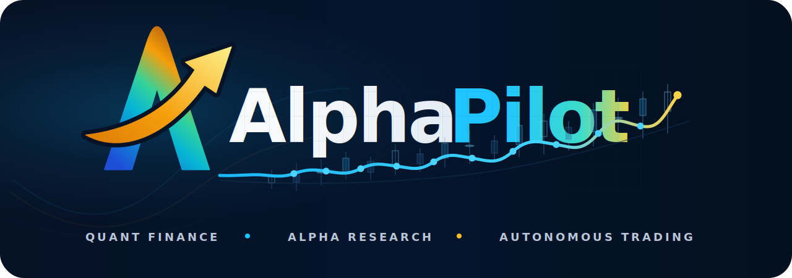
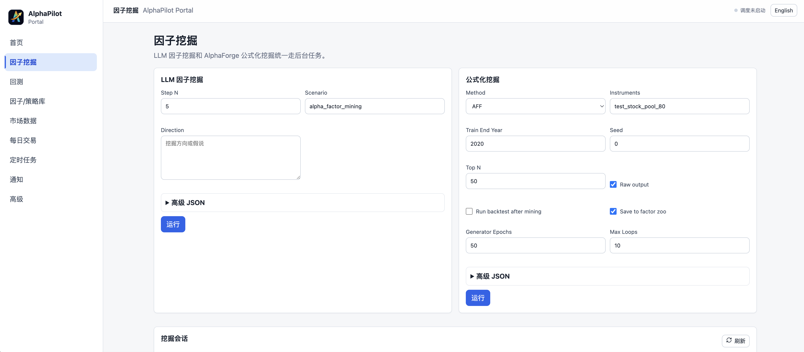
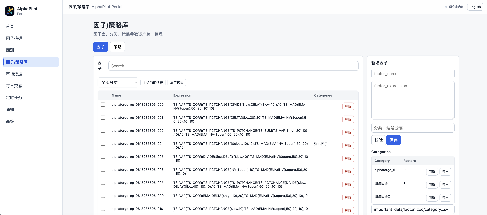
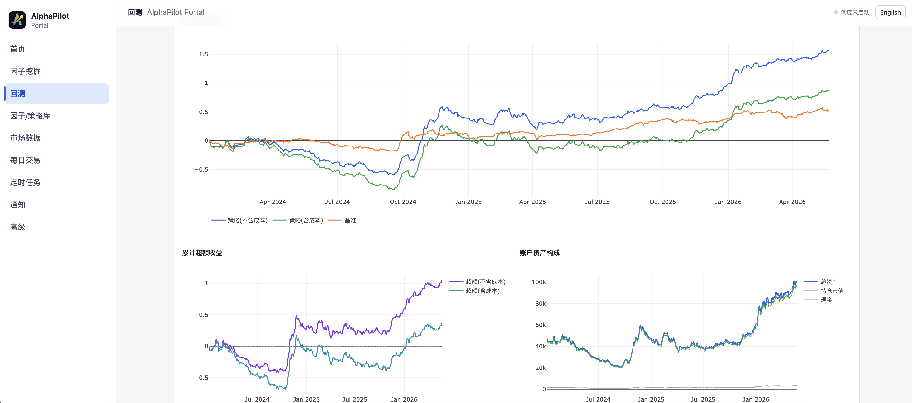
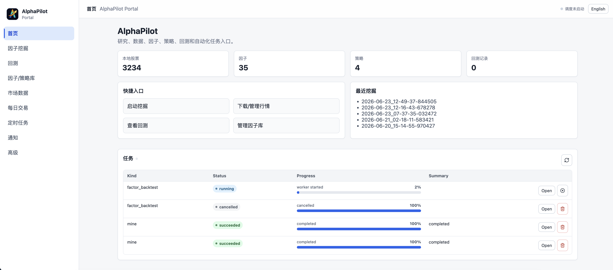
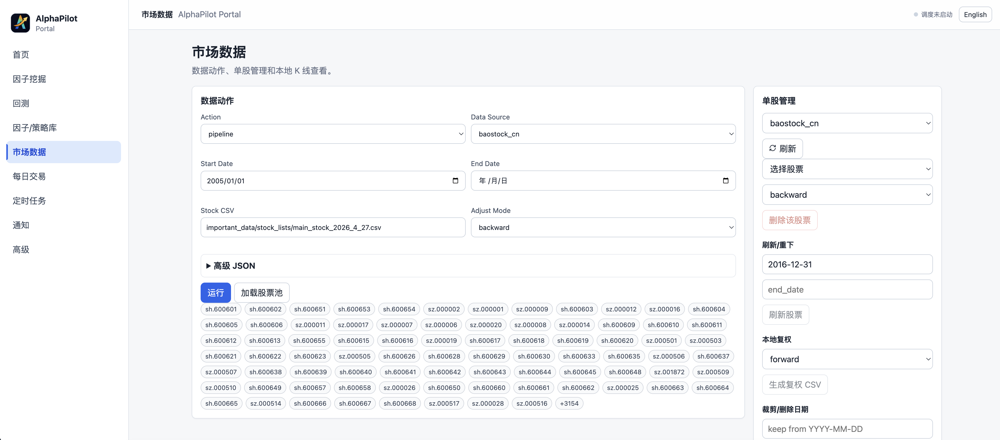
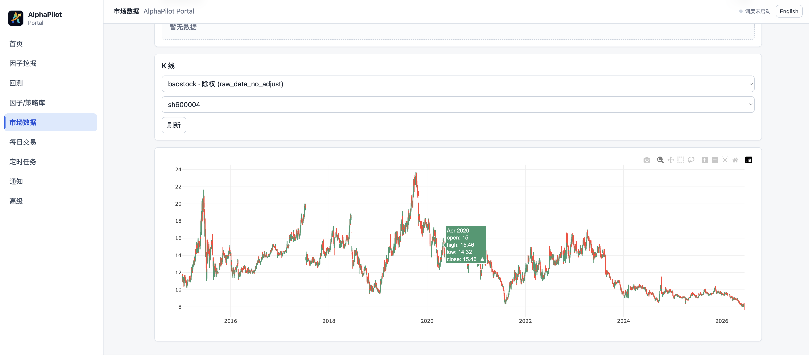
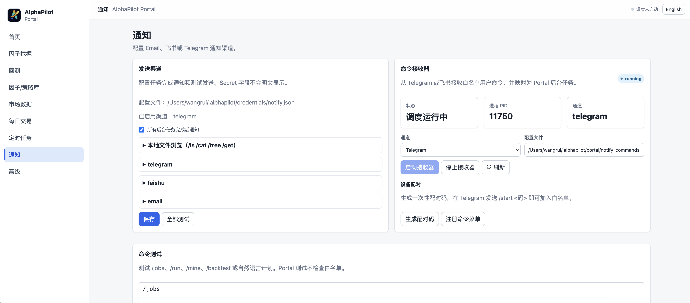

<div align="center">



### LLM-driven quantitative factor mining, backtesting, and strategy research platform

[中文](README_cn.md)&nbsp;|&nbsp;[English](README.md)

`Multi-agent factor mining`&nbsp;·&nbsp;`Qlib backtesting`&nbsp;·&nbsp;`Web portal`&nbsp;·&nbsp;`Data preparation`&nbsp;·&nbsp;`Daily signals`&nbsp;·&nbsp;`Telegram/Feishu notifications`

<p>
  
  
  
  
</p>

[Quick Start](#-quick-start)&nbsp;·&nbsp;[Core Features](#core-features)&nbsp;·&nbsp;[Typical Workflow](#-typical-workflow)&nbsp;·&nbsp;[Docs](#-more-documentation)&nbsp;·&nbsp;[Docker Deployment](docs/DOCKER.md)

</div>

---

## Project Overview

AlphaPilot is a stock-focused quantitative research platform for factor mining and strategy validation. It provides a unified workflow around factor generation, backtest evaluation, strategy retesting, and daily research operations. The project uses an LLM-driven multi-agent research pipeline for factor discovery, Qlib for backtesting and signal validation, and a Web portal for managing data, tasks, notifications, and research assets.

## Core Features

| Capability | Main Entry | Description |
|------------|------------|-------------|
| Factor mining | `alphapilot mine` | LLM multi-agent workflow plus formula-based AlphaForge / GP / RL / AFF methods |
| Backtest evaluation | `alphapilot backtest` | Portfolio backtests, per-factor IC screening, leaderboards, and return curves |
| Strategy creation | `alphapilot strategy_create` | Save selected factors as strategy assets with factors, model, rebalance settings, costs, and dates |
| Strategy retesting | `alphapilot strategy_backtest` | Reuse saved strategy assets and models for continued validation |
| Daily signals | `alphapilot daily_signals` | Advance positions by trading day and generate single-day rebalance signals |
| Trade sessions | `alphapilot trade_session_create` | Snapshot a strategy into a self-contained, resumable daily-trade account |
| Unified portal | `alphapilot portal` | Central UI for data, factors, backtests, tasks, and notifications |
| Data preparation | `alphapilot prepare_data` | baostock / tushare to Qlib to factor h5 pipeline |
| Notifications and remote control | `alphapilot notify_commands` | Task completion notifications through Telegram / Feishu / email plus remote chat commands |

### Factor Mining

AlphaPilot's primary workflow is automated factor research. You can start an LLM-driven multi-agent mining process with natural language, or use formula-based methods in the same project to generate candidate factors before validation, backtesting, and asset persistence.

- Unified management for the Idea Agent, Factor Agent, and Eval Agent research stages
- Supports `alphapilot mine` for LLM-driven factor mining
- Supports formula-based mining methods including GP, RL, and AFF
- Factors can be saved into the factor library and reused for backtests or strategy assets

Main entry: `alphapilot mine --direction "your market hypothesis"`

<div align="center">
  
  <br><br>
  
</div>

### Backtesting and Evaluation

The project includes multiple backtesting and evaluation modes. It supports formal portfolio backtests and quick screening for large candidate factor sets. The README keeps only the common entries; see the [CLI command reference](docs/alphapilot-cli.md) for more commands and parameters.

- `multi_combined`: combine multiple factors, train a model, and run a portfolio backtest
- `single_ic`: quickly calculate IC, RankIC, and ICIR for each factor
- `multi_sequential`: run full portfolio backtests for factors one by one
- Portal backtest page: visualizes returns, excess returns, account composition, turnover, daily details, factor leaderboards, and benchmark comparisons

Main entry: `alphapilot backtest --factor_path /path/to/factors.csv`

<div align="center">
  
</div>

### Strategy Retesting and Daily Signals

After a strategy asset has been saved, you can reuse existing factors and models for further validation without running the full mining pipeline again. For daily research or simulated trading scenarios, AlphaPilot can also generate single-day rebalance signals from saved strategies.

- `strategy_backtest` retests saved strategy assets
- `daily_signals` advances position state by a specified trading day
- `trade_session_create` / `trade_session_show` / `trade_session_history` manage self-contained daily-trade sessions with their own strategy snapshot, state, and history
- Suitable for model reuse, strategy revalidation, and single-day rebalance drills
- Results can flow back into strategy assets and the portal for unified review

Main entry: `alphapilot strategy_backtest --strategy_name "<strategy name>" --mode=retrain`

### Unified Web Portal

AlphaPilot provides a unified Web portal as the daily research entry point. It brings data, factors, backtests, tasks, and notifications into one interface, reducing context switching across scripts and standalone pages.

- Unified access to factor mining, backtesting, strategy libraries, market data, and notification settings
- Supports background tasks, scheduled tasks, and result review
- Built-in backtest visualizations: cumulative returns, excess returns, account composition, turnover charts, date-range filters, daily details, factor leaderboards, and benchmark comparisons
- Suitable for both local research environments and server deployments

Main entry: `alphapilot portal`

<div align="center">
  
</div>

### Data Preparation and Management

The project includes a complete A-share data preparation pipeline, from raw market data to Qlib data and factor h5 files. This README keeps the shortest path; see the detailed documentation for data sources, adjustment modes, and advanced parameters.

- Supports baostock and tushare data sources
- Supports market data downloads, price adjustment, Qlib conversion, and h5 generation
- Supports stock pool management and single-stock data maintenance
- Connects directly with factor mining, backtesting, and daily signal generation

Main entry: `alphapilot prepare_data download --stock_csv important_data/stock_lists/main_stock_2026_4_27.csv`

<div align="center">
  
  <br><br>
  
</div>

### Notifications and Remote Control

Research tasks often take a long time. AlphaPilot includes task notifications and a two-way chat command system: completed background tasks can proactively push results, and you can also start, query, and manage tasks remotely from chat tools without watching a terminal.

- Supports **Telegram, Feishu, and email** notification channels
- Automatically pushes task completion or all-task status updates
- Telegram / Feishu command receivers support `/mine`, `/backtest`, `/data`, `/status`, `/jobs`, `/cancel`, `/log`, `/result`, and more
- Whitelisted user authentication for remote task submission, log review, artifact lookup, and status checks
- Credentials can be configured in the portal notification page or injected through `ALPHAPILOT_NOTIFY_*` environment variables

Main entry: `alphapilot notify_commands --channel telegram`

<div align="center">
  
</div>

## 🚀 Quick Start

The following flow focuses on local installation and a minimal working loop. For **one-command Docker deployment**, see [docs/DOCKER.md](docs/DOCKER.md).

### 1. Create an Environment

```bash
conda create -n alphapilot python=3.11
conda activate alphapilot
```

### 2. Install the Project

```bash
git clone https://github.com/ai-yang/AlphaPilot.git
cd AlphaPilot
pip install -e .
```

If you need the Web portal frontend, install Node.js and build the frontend assets under `alphapilot/modules/portal/web`:

```bash
cd alphapilot/modules/portal/web
npm install
npm run build
cd ../../../../
```

### 3. Configure Environment Variables

```bash
cp .env.example .env
```

At minimum, fill in:

```env
OPENAI_API_KEY=<your_api_key>
OPENAI_BASE_URL=<your_api_base_url>
CHAT_MODEL=<your_chat_model>
REASONING_MODEL=<your_reasoning_model>
```

### 4. Prepare Data

```bash
alphapilot prepare_data download \
  --stock_csv important_data/stock_lists/main_stock_2026_4_27.csv \
  --adjust_mode backward

alphapilot prepare_data convert \
  --stock_csv important_data/stock_lists/main_stock_2026_4_27.csv \
  --adjust_mode backward \
  --market main_stock_2026_4_27

alphapilot prepare_data h5
```

### 5. Start the Portal

```bash
alphapilot portal
```

Default URL: `http://127.0.0.1:19901`

> The default timezone is **Asia/Shanghai**, which affects scheduled tasks and timestamp display. You can change it in the portal's Advanced page under Portal Settings, or run `alphapilot timezone Asia/Shanghai`.

### 6. Run a Task

Start a factor mining task:

```bash
alphapilot mine --direction "behavioral finance hypothesis" --step_n 5
```

Or run a backtest on an existing factor file:

```bash
alphapilot backtest --factor_path /path/to/factors.csv
```

Or snapshot a strategy into a resumable daily-trade session and generate the next rebalance plan:

```bash
alphapilot trade_session_create --strategy_name "<strategy name>" --name demo_session --init_cash 500000
alphapilot daily_signals --session demo_session
```

## 🧭 Typical Workflow

1. Use `prepare_data` to prepare market data, Qlib data, and `daily_pv.h5`.
2. Use `mine` or AlphaForge commands to generate candidate factors.
3. Use `backtest` for portfolio backtests or quick IC screening, then review results in the portal.
4. Save effective strategies as strategy assets, then continue validation with `strategy_backtest`, `daily_signals`, or a resumable `trade_session`.

## 📚 More Documentation

- [Full CLI command reference](docs/alphapilot-cli.md)
- [Project structure and architecture](docs/alphapilot-structure.md)
- [Docker deployment and service mode](docs/DOCKER.md)
- [Docker run notes and troubleshooting](docs/DOCKER-RUN.md)
- [important_data directory, templates, and assets](important_data/README.md)
- [AlphaForge notes](alphapilot/modules/alphaforge/README.md)

## 📂 Directory Structure

```text
AlphaPilot/
├── alphapilot/          # Main application and modules
├── important_data/      # Factor library, strategy assets, templates, and stock pools
├── docs/                # Detailed documentation
├── tests/               # Test cases
├── docker-compose.yml   # Docker service orchestration
└── README.md            # Project home page
```

## 🚧 Development Status and Roadmap

> AlphaPilot is still under active development. Some known bugs are being fixed and optimized, features and interfaces may change, and the project will continue to be updated.

Planned directions:

- [ ] Add support for US equities
- [ ] Improve the interactive UI and add more tunable options, including rebalancing methods and LightGBM model parameters
- [ ] Integrate more factor mining methods
- [ ] Continue fixing known issues and improving documentation and stability
- [ ] Add paper trading and live trading systems

Issues and PRs are welcome.

## Development Log

| Date | Type | Feature / Module | Goal | Key Changes | Affected Entry | Verification | Status / Follow-up |
|------|------|------------------|------|-------------|----------------|--------------|--------------------|
| 2026-06-26 | New | Portal parameter help | Make complex task/config panels easier to use consistently | Added reusable question-mark help panel, expanded help copy across mining, backtest, library, market data, daily trade, scheduler, notifications, and advanced settings; added Daily Trade left-panel title | Portal task/config panels | `npm run build`; `npm run typecheck` blocked by existing `tsconfig.json` `ignoreDeprecations: "6.0"` incompatibility with TypeScript 5.9 | Completed; fix tsconfig before relying on typecheck |
| 2026-06-24 | Optimization | Portal market data / K-line chart | Improve the local K-line viewing experience | Main chart plus sub-chart layout; sub-chart supports amount, volume, turnover, and price-change switching; added range buttons, unified hover behavior, and light/dark theme adaptation | Portal Market Data page | `npm run typecheck`; `npm run build` | Completed |
| 2026-06-24 | New | Factor library / duplicate check | Help clean duplicate or near-duplicate factors and reduce factor library maintenance cost | Added duplicate factor detection, keep/delete suggestions, bulk-delete APIs, and Portal entry | Portal Factor / Strategy Library page; `/api/factors/duplicates`; `/api/factors/bulk-delete` | Frontend `npm run typecheck`; `npm run build` covered UI compilation | Completed; backend API unit tests still needed |

## 🙏 Acknowledgements

This project is inspired by [RndmVariableQ/AlphaAgent](https://github.com/RndmVariableQ/AlphaAgent) and [DulyHao/AlphaForge](https://github.com/DulyHao/AlphaForge), with further development and optimization. Thanks to the original authors and the community.

<div align="center">
<br>

&nbsp;&nbsp;&nbsp;&nbsp;&nbsp;&nbsp;&nbsp;&nbsp;<b>×</b>&nbsp;&nbsp;&nbsp;&nbsp;&nbsp;&nbsp;&nbsp;&nbsp;

<br><br>
<sub><b>AlphaPilot · Stock Quantitative Research Platform</b>&nbsp;&nbsp;×&nbsp;&nbsp;<b>ZJU Eagle Lab</b></sub>
</div>
