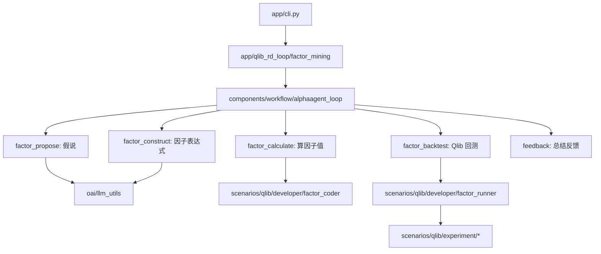
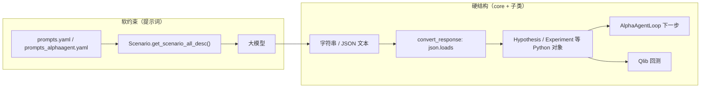

# AlphaAgent 项目与 `alphaagent` 包结构说明

本文档说明 AlphaAgent 项目的整体目标，以及 Python 包 `alphaagent/` 内各目录的职责与主流程调用关系。

**目录**

- [项目整体在做什么](#项目整体在做什么)
- [`alphaagent/` 目录总览](#alphaagent-目录总览)
- [各子目录作用](#各子目录作用)
- [一次 `alphaagent mine` 的代码路径](#一次-alphaagent-mine-的代码路径)
- [core 模块详解：与提示词、大模型输出](#core-模块详解与提示词大模型输出)
- [与项目根目录其他部分的关系](#与项目根目录其他部分的关系)
- [本 fork 相对原版的主要改动](#本-fork-相对原版的主要改动摘要)

---

## 项目整体在做什么

**AlphaAgent** 是一个用 **大模型 + Qlib** 做 **自动因子挖掘** 的 Python 包。核心流程是三个 Agent 协作、循环迭代：

| Agent | 职责 |
|-------|------|
| **Idea Agent** | 根据市场假说提出/改进假设 |
| **Factor Agent** | 把假设变成因子表达式和可执行代码 |
| **Eval Agent** | 用 Qlib 回测，把 IC、收益等结果反馈给下一轮 |

命令行入口在 `pyproject.toml` 中注册为 `alphaagent`，实现在 `alphaagent/app/cli.py`：

| 命令 | 作用 |
|------|------|
| `alphaagent mine` | 主流程：自动挖因子 |
| `alphaagent backtest` | 对已有因子 CSV 做回测 |
| `alphaagent ui` | Streamlit 查看运行日志 |
| `alphaagent backtest_ui` | 本 fork 新增：查看回测持仓/收益曲线 |
| `alphaagent health_check` | 环境健康检查 |
| `alphaagent collect_info` | 收集环境信息 |

---

## `alphaagent/` 目录总览

可将 `alphaagent` 理解为：

- **框架层**：`core` + `components`
- **业务场景**：`scenarios/qlib`
- **应用入口**：`app`
- **基础设施**：`oai`、`log`、`utils`

### 主流程示意



---

## 各子目录作用

### `app/` — 命令行与应用入口

| 路径 | 职责 |
|------|------|
| `cli.py` | 加载 `.env`，用 Fire 分发子命令 |
| `qlib_rd_loop/factor_mining.py` | `alphaagent mine` 入口 |
| `qlib_rd_loop/factor_backtest.py` | `alphaagent backtest` 入口 |
| `qlib_rd_loop/factor_from_report.py` | 从研报 PDF 抽因子（扩展流程） |
| `qlib_rd_loop/conf.py` | 将「用哪个类做假说/编码/回测」串成配置 |
| `backtest_viewer/` | 本仓库新增的 Streamlit 回测可视化 |
| `benchmark/` | 因子/模型评测脚本 |
| `CI/` | 持续集成相关辅助 |
| `utils/` | 健康检查、环境信息收集 |

### `core/` — 抽象框架（与 Qlib 无关的通用骨架）

源自 RD-Agent 的设计，定义「研究循环」里的核心概念：

| 模块 | 职责 |
|------|------|
| `scenario.py` | 场景描述：背景、数据、接口、输出格式（喂给 LLM 的上下文） |
| `proposal.py` | `Hypothesis`、`Trace`、假说生成 / 转实验 / 生成反馈的抽象 |
| `experiment.py` | `Task`、`Workspace`、`Experiment`：一次实验的工作区与任务 |
| `developer.py` | `Developer`：编码器、运行器的统一接口 |
| `evolving_framework.py` / `evolving_agent.py` | 进化式迭代、RAG、知识库 |
| `knowledge_base.py` | 知识库基类 |
| `evaluation.py` | 评估与 `Feedback` |
| `conf.py` | 配置基类，支持环境变量前缀 |
| `exception.py` | `FactorEmptyError`、`CoderError` 等 |
| `prompts.py` / `template.py` | 提示词与代码模板 |

> **延伸阅读**：`core` 并不直接「约束」大模型输出；提示词与 Python 抽象的分工见下文 [core 模块详解](#core-模块详解与提示词大模型输出)。

### `components/` — 可复用组件（跨场景）

| 子目录 | 职责 |
|--------|------|
| `workflow/` | `AlphaAgentLoop`：将 propose → construct → calculate → backtest → feedback 串成循环；`conf.py` 定义配置字段 |
| `coder/factor_coder/` | 因子表达式解析、AST、模板、评测 |
| `coder/model_coder/` | 模型代码生成 |
| `coder/CoSTEER/` | 进化式代码修复策略 |
| `coder/data_science/` | 数据科学流水线占位模块 |
| `proposal/` | 通用 proposal 提示词 |
| `loader/` | 从任务/实验定义加载数据 |
| `document_reader/` | 读 PDF 等文档（研报抽因子用） |
| `knowledge_management/` | 向量库等知识检索 |
| `runner/` | 运行器相关抽象 |
| `benchmark/` | 基准评测配置与方法 |

### `scenarios/qlib/` — Qlib 因子/模型场景（本仓库最核心）

把 `core` + `components` 接到 **A 股 / Qlib 回测** 上：

| 子目录 | 职责 |
|--------|------|
| `proposal/` | Idea Agent：生成假说、将假说转为因子表达式 |
| `developer/factor_coder.py` | 解析表达式、生成/执行因子 Python 代码 |
| `developer/factor_runner.py` | 调用 Qlib 回测，读取 IC、收益等 |
| `developer/feedback.py` | 将回测结果总结为下一轮 prompt |
| `developer/model_coder.py` / `model_runner.py` | 模型训练场景（次要） |
| `experiment/factor_experiment.py` | `QlibAlphaAgentScenario`：给 LLM 的场景说明 |
| `experiment/factor_template/` | `conf.yaml`、`conf_cn_combined_kdd_ver.yaml` 等回测配置 |
| `experiment/factor_data_template/` | `generate.py` 导出 `daily_pv.h5` 供因子计算 |
| `experiment/workspace.py` | 每次实验的工作目录 |
| `factor_experiment_loader/` | 从 JSON / PDF 加载已有因子定义 |
| `regulator/` | 因子合规/质量检查 |
| `docker/` | 可选 Docker 回测环境 |
| `prompts_*.yaml` | 各阶段 LLM 提示词 |

#### 默认因子挖掘配置类映射

`app/qlib_rd_loop/conf.py` 中的 `AlphaAgentFactorBasePropSetting` 将各环节实现类串联如下：

| 配置项 | 默认实现类 |
|--------|------------|
| `scen` | `QlibAlphaAgentScenario` |
| `hypothesis_gen` | `AlphaAgentHypothesisGen` |
| `hypothesis2experiment` | `AlphaAgentHypothesis2FactorExpression` |
| `coder` | `QlibFactorParser` |
| `runner` | `QlibFactorRunner` |
| `summarizer` | `AlphaAgentQlibFactorHypothesisExperiment2Feedback` |

### `oai/` — 大模型调用

| 文件 | 职责 |
|------|------|
| `llm_conf.py` | 模型名、API、超时等（读取 `.env`） |
| `llm_utils.py` | 封装 OpenAI 兼容 API；本 fork 增强了 JSON 解析容错（适配 MiniMax 等） |

### `log/` — 日志与可视化

| 路径 | 职责 |
|------|------|
| `logger.py` / `storage.py` | 结构化记录每轮假说、代码、回测结果 |
| `ui/` | `alphaagent ui` 使用的 Streamlit 界面 |
| `ui/qlib_report_figure.py` | Qlib 报告图表 |

### `utils/` — 工具

| 路径 | 职责 |
|------|------|
| `agent/tpl.py` | Jinja/YAML 模板渲染（拼接 prompt） |
| `workflow.py` | `LoopBase` / `LoopMeta`，驱动多步循环 |
| `env.py` | 环境相关辅助 |
| `repo/` | 仓库/路径工具 |

---

## 一次 `alphaagent mine` 的代码路径

`AlphaAgentLoop`（`components/workflow/alphaagent_loop.py`）定义 5 个步骤：

| 步骤 | 方法 | 说明 |
|------|------|------|
| 1 | `factor_propose` | `hypothesis_generator.gen(trace)` → 生成市场假说 |
| 2 | `factor_construct` | `factor_constructor.convert(...)` → 生成多个因子表达式/子任务 |
| 3 | `factor_calculate` | `coder.develop(...)` → 在 `daily_pv.h5` 上计算因子表 |
| 4 | `factor_backtest` | `runner.develop(...)` → Qlib + LightGBM 回测 |
| 5 | `feedback` | `summarizer.generate_feedback(...)` → 写入 `trace`，进入下一轮 |

相关配置、数据与提示词位于 `scenarios/qlib/experiment/` 及各类 `prompts*.yaml`；运行产物默认在 `git_ignore_folder/`（工作区、缓存、日志）。

---

## core 模块详解：与提示词、大模型输出

### 一句话结论

| 层次 | 做什么 | 能否保证模型听话 |
|------|--------|------------------|
| **提示词**（`prompts*.yaml`） | 软约束：描述输出格式、任务背景 | 不能 100%，只是「请求」 |
| **`core/` 抽象** | 硬结构：流水线里每一步传什么类型、谁调用谁 | 不直接管模型，管的是 **程序怎么接模型结果** |
| **子类实现**（`scenarios/`、`components/`） | `json.loads` + `convert_response` + 异常重试 | 模型乱写时 **解析失败 / 抛错 / 重试** |

**约束模型输出格式 → 主要靠提示词；`core` 定义的是「接得住模型输出之后，系统长什么样」。**

---

### `core/` 各文件在干什么（不是「约束 LLM」）

#### 1. 流水线骨架（和模型无关的「插槽」）

| 模块 | 作用 |
|------|------|
| `proposal.py` | `Hypothesis`、`Trace`、`HypothesisGen` 等：假说—实验—反馈的数据与三步接口 |
| `developer.py` | `Developer.develop(exp)`：编码 / 回测执行的统一入口（coder、runner 都实现它） |
| `experiment.py` | `Task`、`Experiment`、`Workspace`、`FBWorkspace`：一次实验的任务 + 磁盘工作区 + 执行代码 |
| `scenario.py` | `Scenario`：拼出给 LLM 的 **场景说明**（背景、数据、接口、`output_format` 文本） |
| `evaluation.py` | `Feedback`、`Evaluator`：评估结果的抽象 |

这些是 **面向对象的流水线设计**（来自 RD-Agent），让 `AlphaAgentLoop` 可以写死五步，而 Qlib 因子、模型训练等用不同子类替换。

#### 2. 进化 / 知识（偏 CoSTEER 代码迭代）

| 模块 | 作用 |
|------|------|
| `evolving_framework.py` | `EvolvableSubjects`、`EvolvingStrategy`、`RAGStrategy`：多轮改代码、查知识库 |
| `evolving_agent.py` | 把进化策略串起来 |
| `knowledge_base.py` | 知识库基类 |

用于 **因子/模型代码写错后的迭代修复**，不是假说 JSON 那一步。

#### 3. 基础设施

| 模块 | 作用 |
|------|------|
| `conf.py` | `.env` / 环境变量、工作区路径等配置 |
| `prompts.py` | 从 YAML **加载** 提示词字典（本身不写业务 prompt） |
| `template.py` | 代码模板 |
| `exception.py` | `FactorEmptyError`、`CoderError` 等，控制循环是否跳过 |
| `utils.py` | 单例、`import_class` 等工具 |

---

### 提示词 vs `core`：分工示意



以生成假说为例，实际调用链在 `components/proposal/__init__.py`：

1. 用 Jinja 渲染 `system_prompt` / `user_prompt`，注入 `hypothesis_output_format`（来自 YAML）和 `scenario`（来自 `Scenario`）。
2. `APIBackend().build_messages_and_create_chat_completion(..., json_mode=...)`
3. **`convert_response(resp)`**：`json.loads` → 填入 `Hypothesis(...)` 各字段。

格式说明在 **prompt** 里；字段形状在 **`Hypothesis` 类**里。模型若少字段、乱 JSON，`convert_response` 会报错，外层可能重试（`MAX_RETRY`）或走 `oai/llm_utils.py` 的 JSON 修复（本 fork 增强）。

---

### 为什么 `Hypothesis` 等要是「固定字段」格式？

不是因为 Python 能约束模型，而是因为 **后续代码必须用结构化数据**：

1. **循环要存历史**：`trace.hist` 是 `(Hypothesis, Experiment, HypothesisFeedback)`，日志、UI、下一轮 prompt 都要按字段取。
2. **模板要填槽**：`hypothesis_and_feedback` 等 Jinja 模板需要 `hypothesis.hypothesis`、`concise_observation` 等固定名字。
3. **类型与可替换性**：`gen() -> Hypothesis`、`convert(hypothesis) -> Experiment` 让整条链路可换实现、可测试。
4. **和 Qlib 解耦**：`core` 不知道 IC、LightGBM；只知道「有一个 Experiment 对象要 `develop`」。

`Scenario.output_format` 也是 **一段会塞进 prompt 的字符串**（常从 YAML 拷到 `QlibAlphaAgentScenario._output_format`），不是运行时 JSON Schema 校验器。

---

### 常见问题

#### `core` 能约束大模型输出吗？

**不能直接约束。** 模型看不到 `Hypothesis` 类定义。

间接手段包括：

- 通过 `Scenario` 把格式说明文本送进 prompt；
- 子类在 `convert_response` 里解析（不守规矩就失败）；
- `json_mode`、重试、`extract_and_validate_llm_json`（在 `oai/`，不在 `core`）。

#### 为什么有多个 `concise_*` 字段？

这是 RD-Agent / AlphaAgent 流程的设计：把 LLM 输出拆成「完整叙述 + 若干简短摘要」，方便：

- 下一轮 prompt 只带 **短摘要**（省 token）；
- 日志和人类阅读；
- 反馈里区分 observation / justification / knowledge。

字段名与 prompt 里的 JSON 说明对齐；对齐发生在 **YAML + `convert_response`**，不是 `core` 自动生成 schema。

#### 约束输出不该只靠提示词吗？

**只靠提示词不够**：

| 仅靠 prompt | 加上 `core` + 解析代码 |
|-------------|------------------------|
| 模型仍可能漏字段、加 markdown、尾逗号 | `json.loads` + 容错函数可检测/修复 |
| 无法驱动 Python 回测 | 必须变成 `Experiment` / `Workspace` |
| 难以做 5 步循环、断点续跑 | `Trace`、`LoopBase` 需要稳定对象 |
| 换 Qlib / 换场景要改整条链 | 只换 `scenarios` 子类，`core` 不变 |

更准确的说法：

- **提示词** = 对模型的 **软约束**（希望它怎么写）
- **`core` 类型** = 对程序的 **硬契约**（接下去每一步假定有什么数据）
- **`convert_response` / `regulator` / `expr_parser`** = **软约束失败后的补救与校验**

---

### `proposal.py` 在其中的位置

`proposal.py` 是 `core` 里最贴近「LLM 研究循环」的一块：

| 概念 | 角色 |
|------|------|
| `Hypothesis` / `HypothesisFeedback` | 内存里的数据结构（不是 prompt） |
| `HypothesisGen` 等 | 接口；真正实现里会调 LLM + prompt |
| `Trace` | 多轮 `(假说, 实验, 反馈)` 历史 |

它不是「另一种提示词」，而是 **「提示词 + 模型」之后，系统内部用的标准件**。

与 `AlphaAgentLoop` 的对应关系：

```
Trace（历史）
    ↓
HypothesisGen.gen()                    → Hypothesis
    ↓
Hypothesis2Experiment.convert()        → Experiment
    ↓
（coder / runner 执行，不在 proposal.py）
    ↓
HypothesisExperiment2Feedback.generate_feedback() → HypothesisFeedback
    ↓
写入 trace.hist，下一轮再用
```

---

### 想改行为时应该改哪里

| 目标 | 建议修改位置 |
|------|--------------|
| 让模型多输出一个字段 | YAML 的 `hypothesis_output_format` + 子类 `convert_response` + 必要时扩展 `Hypothesis` |
| 改挖掘流程几步、换组件 | `core` 接口 + `conf.py` 类名 + `alphaagent_loop.py` |
| 改 Qlib 回测、因子表达式 | `scenarios/qlib/`，一般不动 `core` |
| 模型 JSON 经常坏 | `oai/llm_utils.py`、重试配置 |

---

## 与项目根目录其他部分的关系

| 位置 | 与 `alphaagent` 的关系 |
|------|------------------------|
| `prepare_cn_data.py` | 根目录脚本：下载 A 股 CSV，供 Qlib 转换；**不在** `alphaagent` 包内 |
| `requirements.txt` / `pyproject.toml` | 安装 `alphaagent` 包并注册 CLI |
| `.env` | API Key、`USE_LOCAL` 等，由 `cli.py` 与 `llm_conf` 读取 |
| `backup_data/` | 个人股票列表等备份，不参与程序自动加载 |
| `.github/` | GitHub Actions、Dependabot、Issue/PR 模板（本地开发通常无影响） |

---

## 本 fork 相对原版的主要改动（摘要）

1. **LLM JSON 容错**（`oai/llm_utils.py`）：适配非标准 JSON 输出  
2. **回测可视化**（`app/backtest_viewer/`）：`alphaagent backtest_ui`  
3. **数据脚本**（`prepare_cn_data.py`）：baostock 下载 A 股数据  
4. **回测配置**（`scenarios/qlib/experiment/factor_template/`）：A 股合并因子回测 YAML  

更完整的使用说明见项目根目录 [README.md](../README.md)。
