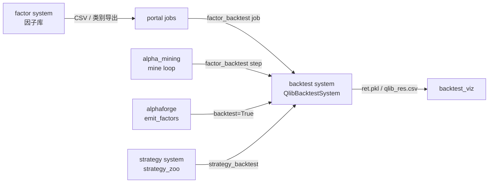
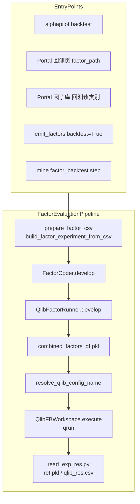
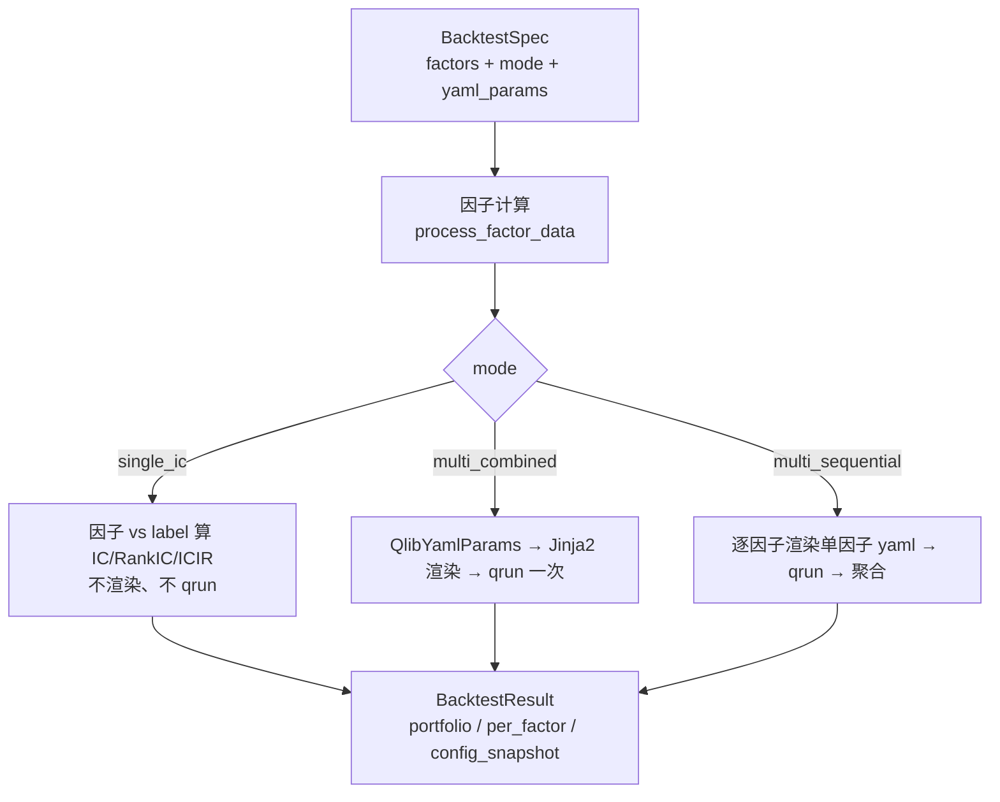

# AlphaPilot 回测系统设计文档

本文档说明 AlphaPilot 当前回测（backtest）系统的实现、语义、已知问题与演进规划。语言以中文为主，关键 API / Qlib 术语附英文。

**相关文档**

- [CLI 命令参考](alphapilot-cli.md)
- [项目与包结构](alphapilot-structure.md)
- [Qlib 模板目录](../important_data/factor_qlib_templates/README.md)
- [Adapters 层说明](../alphapilot/adapters/README.md)（回测不在 adapter 层）

---

## 1. 概述（Overview）

### 1.1 在架构中的位置

AlphaPilot 采用 **kernel + systems + modules** 分层：

| 层 | 路径 | 回测相关职责 |
|----|------|----------------|
| 内核 | `alphapilot/kernel/` | `Context.backtest()`、`AppConfig` 路径 |
| 回测系统 | `alphapilot/systems/backtest/` | `QlibBacktestSystem`、管线、runner、workspace、产物 |
| 模块 | `alphapilot/modules/alpha_mining/` | CLI `backtest`、mine 循环中的 `factor_backtest` 步 |
| 模块 | `alphapilot/modules/strategy_backtest/` | 策略资产复测 CLI |
| 模块 | `alphapilot/modules/portal/` | Web 触发 `factor_backtest` job |
| 模块 | `alphapilot/modules/backtest_viz/` | 回测 workspace 可视化 |

回测引擎固定在 **backtest system** 内，不经 `adapters/` 可插拔层（见 `alphapilot/adapters/README.md`）。替换实现可通过 `pyproject.toml` 的 `[project.entry-points."alphapilot.systems"]` 注册另一个 `BaseBacktestSystem` 子类。

### 1.2 核心结论（请先读）

当前默认的「因子回测」路径是：

**多因子合并（combined features）→ `qrun` + YAML → LightGBM（`LGBModel`）训练 → `TopkDropoutStrategy` 组合模拟 → 一份 workspace 指标**

而不是：

- 单因子逐个跑完整 Qlib 回测
- 单因子 IC / Rank IC 快筛（因子库 UI 未单独暴露）

因子**表达式**会逐个计算数值，但 **Qlib 评估阶段**默认把所有因子列合并后做一次组合回测。

### 1.3 与其他子系统的关系



- **因子库入库**：`FactorRegulator` 做语法与相似度校验，与回测无关。
- **AlphaForge 挖掘**：内部用 vendored alphagen 算 IC；入库时才读 `factor_zoo`。
- **回测**：只读请求中的因子列表（CSV 或内存），不把因子库已有因子当作挖掘种子。

---

## 2. 当前实现（As-Is Architecture）

### 2.1 主数据流

所有「因子 CSV / 因子列表」类回测，最终汇聚到 `FactorEvaluationPipeline`：



`strategy_backtest` 在 `retrain` 模式下同样调用 `run_factor_evaluation`；`reuse_model` 模式通过 `SavedModelBacktestRequest` + `PretrainedLGBModel` 跳过训练。

### 2.2 模块职责表

| 模块 | 路径 | 职责 |
|------|------|------|
| 请求类型 | `alphapilot/systems/backtest/types.py` | `FactorBacktestRequest`、`SavedModelBacktestRequest`、`WorkspaceBacktestRequest` 等 |
| 因子评估管线 | `alphapilot/systems/backtest/pipelines/factor_evaluation.py` | CSV → 因子计算 → runner → 返回 `FactorBacktestResult` |
| 因子加载 | `alphapilot/systems/backtest/pipelines/factor_source.py` | 解析 CSV、构建 `QlibFactorExperiment`、**固定设置 `based_experiments`** |
| Factor runner | `alphapilot/systems/backtest/runners/factor_runner.py` | 多进程算因子值、横向 merge、写 pkl、触发 `qrun` |
| Model runner | `alphapilot/systems/backtest/runners/model_runner.py` | 模型实验 `qrun`（mine 部分路径） |
| YAML 选择 | `alphapilot/systems/backtest/qlib_config.py` | `based_experiments` 非空 → `conf_cn_combined_kdd_ver.yaml` |
| Workspace 执行 | `alphapilot/systems/backtest/workspace.py` | `qrun` + `read_exp_res.py` |
| 系统门面 | `alphapilot/systems/backtest/service.py` | `QlibBacktestSystem` |
| YAML 生成/校验 | `alphapilot/systems/backtest/qlib_yaml/` | `QlibYamlParams`、Jinja2 模板、`qlib_yaml_generate` CLI |
| 产物解析 | `alphapilot/systems/backtest/artifacts.py` | `ret.pkl`、持仓、收益曲线（供 `backtest_viz`） |
| 结果索引 | `alphapilot/systems/backtest/results.py` | `BacktestResultStore`、workspace 列表/删除 |
| 策略复测编排 | `alphapilot/systems/strategy/backtest.py` | `retrain` / `reuse_model` → backtest system |
| AlphaForge 输出 | `alphapilot/modules/alphaforge/pipeline.py` | `emit_factors(..., backtest=True)` |
| Portal | `alphapilot/modules/portal/app.py` | 因子库类别回测、回测页 CSV 表单 |
| Portal job | `alphapilot/modules/portal/jobs.py` | `factor_backtest` → `alpha_mining.run_backtest` |

### 2.3 关键代码行为

**从 CSV 构建实验**（`factor_source.py`）：

- 读取 `factor_name`、`factor_expression` 列，去重因子名。
- 创建 `QlibFactorExperiment(tasks, ...)`。
- **始终**设置 `exp.based_experiments = [QlibFactorExperiment(sub_tasks=[], ...)]`（空子任务占位）。

**Runner 合并因子**（`factor_runner.py`）：

- `process_factor_data`：对每个 `sub_workspace` 多进程执行因子代码，得到各因子 DataFrame。
- `pd.concat(..., axis=1)` 横向合并 → `combined_factors_df.pkl`。
- `resolve_qlib_config_name(exp)` 选 yaml，再 `experiment_workspace.execute(qlib_config_name=...)`。

**YAML 默认规则**（`qlib_config.py`）：

```text
优先级：显式 qlib_config_name > exp.qlib_config_name > legacy 规则
legacy：len(based_experiments)==0 → conf.yaml
        否则 → conf_cn_combined_kdd_ver.yaml
```

因 CSV 路径总会设置 `based_experiments`，**未手动指定 yaml 时几乎总是 combined 模板**。

**Workspace 执行**（`workspace.py`）：

```text
qrun {qlib_config_name}
python read_exp_res.py
→ qlib_res.csv, ret.pkl, positions_normal_1day.pkl, ...
```

---

## 3. 行为语义（What “因子回测” Actually Means）

### 3.1 两阶段模型

| 阶段 | 粒度 | 做什么 | 产物 |
|------|------|--------|------|
| **A. 因子计算** | per-factor | `FactorCoder` / `process_factor_data` 执行 DSL 表达式 | 每个因子的时间序列 |
| **B. Qlib 评估** | portfolio-level | 合并特征 → 训练模型 → 选股回测 | 一个 workspace、一份组合指标 |

用户常把「批量因子回测」理解为阶段 A 的重复或单因子 IC；系统默认做的是 **阶段 B 的一次组合回测**。

### 3.2 Combined YAML 里有什么

模板文件（默认）：`conf_cn_combined_kdd_ver.yaml`  
生成模板（Jinja2）：`alphapilot/systems/backtest/qlib_yaml/templates/conf_cn_combined_kdd_ver.yaml.j2`

典型结构：

| 组件 | 类 / 配置 | 说明 |
|------|-----------|------|
| 数据加载 | `NestedDataLoader` | 分支 1：`QlibDataLoader` 内置 4 个价量特征；分支 2：`StaticDataLoader` → `combined_factors_df.pkl` |
| 模型 | `LGBModel` | LightGBM 回归 label |
| 数据集 | `DatasetH` + `DataHandlerLP` | train / valid / test 分段 |
| 记录 | `SignalRecord`、`SigAnaRecord`、`PortAnaRecord` | 信号、IC 分析、组合回测 |
| 策略 | `TopkDropoutStrategy` | `topk`、`n_drop`、`hold_thresh`、`risk_degree` |
| 执行器 | `SimulatorExecutor` | 日频模拟、成本、涨跌停 |

即使 CSV 只有 **1 个因子**，只要走 combined 路径，仍是：**内置特征 + 该因子 → LGBM → Topk 组合**，不是「因子值直接当持仓信号」的纯单因子检验。

### 3.3 Baseline YAML（`conf.yaml`）

- 仅 `QlibDataLoader` 内置价量特征，**不**加载 `combined_factors_df.pkl`。
- 当 `based_experiments` 为空时选用；**从因子 CSV 自动构建的实验不会落到这里**（除非显式传 `qlib_config_name=conf.yaml`，且 pkl 不会被 combined 模板消费）。

---

## 4. 入口与用户使用路径（User-Facing Paths）

| 入口 | 输入 | 实际行为 | 常见误解 |
|------|------|----------|----------|
| Portal → 因子库 → **回测该类别** | 类别下全部因子导出临时 CSV | 一次 `factor_backtest` job，combined 回测 | 以为是类别内逐个测 |
| Portal → 回测分析 → **因子 CSV** | `factor_path` | 同上 | — |
| `alphapilot backtest` | `--factor_path` | 同上 | CLI 描述为「单因子 CSV」易误解为单因子模式 |
| AlphaForge `backtest=True` | 当次 `accepted` 因子列表 | `emit_factors` → `run_factor_evaluation` | — |
| `mine` 循环 | 每轮 `factor_backtest` 步 | `QlibFactorRunner` on 当轮因子实验 | 与 LLM 挖掘流程绑定 |
| `strategy_backtest` | `strategy_zoo` 中策略因子集 | `retrain`：全量重训；`reuse_model`：`PretrainedLGBModel` | 与因子库批量筛选是不同场景 |
| Portal 因子表 **多选** | 选中行 | **仅批量分类**（加/删 category），无回测按钮 | 以为多选可批量回测 |

---

## 5. 问题与根因（Pain Points）

### 5.1 语义错位

- API 名 `run_factor_evaluation`、`FactorBacktestRequest` 暗示「逐因子评估」。
- 实际输出是 **组合策略回测** 的实验级指标（`qlib_res.csv`），不是 per-factor 表。

### 5.2 隐式 YAML / 模板选择

- `build_factor_experiment_from_csv` 无条件设置 `based_experiments` → 强制 combined yaml。
- 用户未传 `qlib_config_name` 时，无法通过 Portal 默认行为得到「纯 baseline」或「单因子专用」模板。

### 5.3 Portal 缺少回测模式

- 因子库无法选择：`single_ic`（快筛）vs `multi_combined`（现有）vs `multi_sequential`（逐个 qrun）。
- 类别回测 = 全类别合并一次，不可拆。

### 5.4 结果形态单一

- 成功路径主要产出：`git_ignore_folder/RD-Agent_workspace/{id}/` 下 `ret.pkl`、`qlib_res.csv`。
- `backtest_viz` 面向组合收益曲线，无「因子库批量 IC 排行榜」一类 UI。

### 5.5 配置分散

- 区间、股票池、`topk`、LGBM 超参写在 yaml 模板或 `QlibYamlParams`。
- Portal 回测表单仅暴露 `factor_path`、`qlib_config_name`、`qlib_template_dir`；改模型/策略需改模板或 `qlib_yaml_generate`。

### 5.6 两套 YAML 机制脱节（根因之根）

5.1–5.5 的多数痛点可归到同一个结构问题：**配置存在两套互不相通的 YAML 机制**。

| 机制 | 代码位置 | 回测运行时是否使用 | 模型 / 策略 |
|------|----------|--------------------|-------------|
| **静态模板**（运行时实际用） | `important_data/factor_qlib_templates/`、`qlib/templates/factor_template/` 下手写的 `conf.yaml` / `conf_cn_combined_kdd_ver.yaml`；`factor_runner` 拷入 workspace 后 `qrun` | **是** | `LGBModel` / `TopkDropoutStrategy` **硬编码在文件里** |
| **Jinja2 生成器**（离线工具） | `QlibYamlParams`（`qlib_yaml/schema.py`）+ `.j2` 模板 + `qlib_yaml_generate` CLI | **否**（仅该 CLI 调用，回测主路径不触发） | `class` 写死在 `.j2`，但超参 / 策略参数 / 区间**已结构化** |

后果：

- `QlibYamlParams` 已把区间、`topk/n_drop`、LGBM 超参等结构化，但**运行时拿不到**——改模型 / 调仓策略只能改静态模板或手动 `qlib_yaml_generate` 再拷贝。
- `build_factor_experiment_from_csv` 无条件设置 `based_experiments`（`factor_source.py:42`），配合只看其长度选 yaml 的 `resolve_qlib_config_name`（`qlib_config.py:11-16`），即 5.2 的「隐式魔法」。
- 静态模板与 `.j2` 是同一份配置的两份手工副本，需人工同步，长期维护成本高。

**这正是第 8 章将「统一到 `QlibYamlParams` + Jinja2 运行时渲染」作为主轴的直接原因。**

---

## 6. Qlib 运行方式对照（Qlib Execution Models）

Qlib 生态有多种用法；AlphaPilot 主路径只覆盖其中一种。

| 方式 | 说明 | AlphaPilot |
|------|------|------------|
| **`qrun` + YAML** | 官方 Workflow CLI，配置 task/model/dataset/record | **主路径**（`QlibFBWorkspace.execute`） |
| **Python Workflow** | `qlib.init()` + `R.start()` 代码驱动 | 未作为主入口；`read_exp_res.py` 用 `R.list_recorders` 读结果 |
| **`init_instance_by_config`** | 按配置片段实例化 Handler 等 | 仅 `qlib_yaml_validate` smoke |
| **`qlib.backtest` API** | Strategy + Executor 底层组合模拟 | 未封装为因子库入口 |
| **信号分析 / IC only** | `SigAnaRecord` 或数据层统计 | yaml 中有 `SigAnaRecord`，但无独立「只跑 IC」的因子库模式 |
| **纯数据层** | `D.features` / `DatasetH` 不算回测 | `prepare_data`、AlphaForge `StockData` |

### 6.1 YAML 是否每次回测都要手写？

**不需要。**

| 机制 | 说明 |
|------|------|
| 模板目录 | 优先 `important_data/factor_qlib_templates/`，否则 `systems/backtest/qlib/templates/factor_template/` |
| Workspace 拷贝 | `QlibFBWorkspace.inject_code_from_folder` 将模板复制到每次运行的 workspace |
| 生成器 | `alphapilot qlib_yaml_generate` 从 `QlibYamlParams` 渲染 Jinja2 模板 |
| 校验 | `alphapilot qlib_yaml_validate` 静态 + 可选 smoke |
| 环境覆盖 | `ALPHAPILOT_QLIB_DATA_DIR` 等在 qrun 前覆盖 `provider_uri` |

日常流程：**维护一份模板副本** 或 **用 CLI 生成 yaml**，而非每次回测手写。只有改区间、股票池、模型、策略、成本时才需要改配置。

---

## 7. 与因子库 / AlphaForge 的边界

### 7.1 因子库（factor system）

| 时机 | 是否读 factor_zoo | 做什么 |
|------|-------------------|--------|
| 挖掘 / 回测运行中 | 否 | 只用请求中的表达式 |
| `add_factor` 入库时 | 是 | 语法解析、AST 相似度（`duplication_threshold` 默认 8）、重名/重复表达式检查 |
| 删除分类 | 否（不删因子） | 只删 `categories` 表与关联 |

### 7.2 AlphaForge（`mine_aff` / `mine_gp` / `mine_rl` / `mine_dso`）

| 阶段 | 去重对象 | 与因子库关系 |
|------|----------|--------------|
| 挖掘中 | 当次候选之间 IC/相关性（AFF `zoo_blds`、`AlphaPool` 等） | 不读 factor_zoo |
| `emit_factors` 入库 | `FactorRegulator` | 与手动 `factor_add` 相同规则 |
| `backtest=True` | 调用 `run_factor_evaluation` | 与 Portal CSV 回测相同 combined 路径 |

---

## 8. 目标架构（To-Be Architecture）

以下为**设计草案**，尚未实现。核心思路：**不另造配置类，而是复用并扩展已存在的 `QlibYamlParams`**，把现有 Jinja2 渲染器接入回测运行时，让「单因子 IC / 多因子组合 / 逐因子完整回测 / 模型 / 调仓策略 / 区间」由同一套 schema 表达；`BacktestSpec` 退化为只做编排的薄壳，并用显式 `template_type` 取代隐式 `based_experiments` 魔法。

### 8.1 概念模型



### 8.2 唯一配置 schema：扩展 `QlibYamlParams`

不新增 `FeatureSpec/ModelSpec/StrategySpec/DatasetSpec`，而是在现有 `QlibYamlParams`（`qlib_yaml/schema.py`）上**补齐缺的字段**，让模型 / 策略从「写死」变「数据」：

```python
# 在现有字段（template_type / 区间 / 特征 / LGBM 超参 / topk·n_drop 等）基础上新增：
model_class: str = "LGBModel"
model_module: str = "qlib.contrib.model.gbdt"
model_kwargs: dict = {}              # 非 LGBM 时承载任意超参；现有 LGBM 标量字段保留为默认/兼容
strategy_class: str = "TopkDropoutStrategy"
strategy_module: str = "qlib.contrib.strategy"
strategy_kwargs: dict = {}           # 覆盖/补充 topk·n_drop·hold_thresh·risk_degree
enable_signal_record: bool = True
enable_sig_ana_record: bool = True   # IC / RankIC 分析
enable_port_ana_record: bool = True  # 组合回测；single_ic 模式关闭
```

随之把 `.j2` 模板（`conf.yaml.j2`、`conf_cn_combined_kdd_ver.yaml.j2`）中写死的 `class: LGBModel`、`class: TopkDropoutStrategy`、三个 record 块参数化为 Jinja2 变量。`template_type`（baseline / combined，已存在）显式表达「是否含内置 4 个价量特征」，取代 `based_experiments` 长度判断。

### 8.3 自定义调仓策略 / 模型（接入用户自有类）

`strategy_class`/`strategy_module`（及 `model_class`/`model_module`）既可指向 Qlib 内置类，也可指向**用户自己实现的类**。复用项目里两处已验证的成熟机制，不另造框架：

| 机制 | 复用的现有实现 | 用法 |
|------|----------------|------|
| 运行时按模块路径反射实例化 | `qrun` 的 `class` + `module_path`；预训练把 module 改写为 `qlib_pretrained`（`qlib_pretrained.py`） | `strategy_module` 指向用户模块即可被实例化 |
| 用户代码注入 workspace | `model_runner.py:26` 的 `inject_code({"model.py": ...})` + `PYTHONPATH="./"` | 增加 `strategy.py` 注入，`strategy_module` 指向本地 `strategy` 模块 |
| 内置目录 + 轻量注册表 | 新增 `alphapilot/systems/backtest/strategies/`（模型同理 `models/`） | 预设名 → `{class, module, default kwargs}`；`strategy_kwargs` 覆盖参数，二次开发零侵入 |

约束：自定义调仓策略须实现 Qlib `BaseStrategy` 接口（`generate_trade_decision` 等），方能被 `PortAnaRecord` / `SimulatorExecutor` 驱动。文档将给出一个最小自定义策略示例及在 `yaml_params` 中引用方式。

### 8.4 `BacktestSpec`：薄编排壳（组合，不替代配置）

```python
# 概念结构（非现有代码）。仅做编排，配置全部委托给 yaml_params。
BacktestSpec(
    factors: list[FactorDefinition] | factor_path | category_name,   # 复用现有 FactorDefinition
    mode: Literal["single_ic", "multi_combined", "multi_sequential"] = "multi_combined",
    yaml_params: QlibYamlParams | dict | None = None,   # None → defaults_for(template_type)，复现今日
    execution: ExecutionSpec(use_local: bool = True, qlib_template_dir: str | None = None),
)
```

落地时**不新建请求类型**：在现有 `FactorBacktestRequest` 等上增加可选 `mode`、`yaml_params` 两字段，默认值复现今日行为，避免改动 CLI / mine loop / AlphaForge / strategy_backtest 全部入口。

### 8.5 运行时数据流（替代静态拷贝 + based_experiments）

```text
BacktestSpec
  → 因子计算（复用 process_factor_data → combined_factors_df.pkl）
  → QlibYamlParams 经 Jinja2 generator 渲染为 yaml（替代静态模板拷贝；
     read_exp_res.py 等 helper 仍从模板目录拷，复用 qlib_yaml_generate 的 --copy_helpers 思路）
  → 按 mode 分派：
      multi_combined  : qrun 一次（模型/策略取自 yaml_params，可配/可自定义） → portfolio 指标
      single_ic       : 关 PortAnaRecord、不训模型，用因子列 vs label 算 IC/RankIC/ICIR → per_factor 表
      multi_sequential: 逐因子各渲染单因子 yaml → qrun → 聚合 → per_factor 排行榜
```

### 8.6 统一结果 `BacktestResult`（扩展）

```python
BacktestResult(
    mode: str,
    per_factor: list[dict] | None,   # single_ic / multi_sequential
    portfolio: dict | None,          # multi_combined：复用 artifacts.py / results.py
    config_snapshot: dict,           # yaml_params + 渲染后 yaml，保证可复现
)
```

### 8.7 预设（Presets）与向后兼容

预设是 `QlibYamlParams` + `mode` 的命名组合，而非新的 Spec 类：

| Preset | 映射 | 用途 |
|--------|------|------|
| `mine_combo` | `mode=multi_combined` + `defaults_for("combined")` | mine、类别回测、AlphaForge backtest（今日默认） |
| `zoo_screen` | `mode=single_ic` | 因子库批量 IC 筛选 |
| `single_full` | `mode=multi_sequential` | 深度单因子 qrun |
| `strategy_reuse` | `mode=multi_combined` + `model_class=PretrainedLGBModel` | 策略复测 skip train |

默认 `mode=multi_combined` + `defaults_for("combined")` 精确复现今日行为，不破坏 `mine` / Portal。

### 8.8 插件点

- `BaseBacktestSystem`（`alphapilot/systems/backtest/base.py`）可子类化；`pyproject.toml` 的 `[project.entry-points."alphapilot.systems"]` 可指向自定义实现——这才是真正的插件缝隙。
- 自定义模型 / 调仓策略走 8.3 的 `*_class`/`*_module` + `strategies/`·`models/` 注册表，无需子类化整个 system。
- `BacktestEngine` 协议（`QlibWorkflowEngine` / `QlibSignalEngine`）**后置**：在出现第三种引擎前不预先抽象，`single_ic` 先作为一个 mode 处理器实现。

---

## 9. 优化路线（Phased Roadmap）

### Phase 0 — 统一 YAML 路径（地基）

| 项 | 内容 |
|----|------|
| 渲染接入 | 把 Jinja2 generator 接入回测运行时，渲染 `QlibYamlParams` 写入 workspace，替代静态模板拷贝 |
| 模板参数化 | `.j2` 的 model / strategy / record 由硬编码改为 Jinja2 变量 |
| 显式选择 | `template_type` 取代 `based_experiments` 选 yaml 的隐式规则 |
| 兼容对拍 | 默认值复现今日行为；同输入下新渲染 yaml 与现有静态 yaml 等价回归 |

**收益**：消除两套 YAML 脱节，是后续所有能力的前提。

### Phase 1 — 可配置 + 可自定义 模型 / 调仓策略（高优先级）

| 项 | 内容 |
|----|------|
| Schema | `QlibYamlParams` 新增 `model_class/module/kwargs`、`strategy_class/module/kwargs`、record 开关 |
| 自定义类 | 模块路径反射 + `strategy.py` / `model.py` 注入 + `strategies/`·`models/` 注册表（见 8.3） |
| 入口 | `FactorBacktestRequest` 等增加 `yaml_params` 字段 |

**收益**：直接解决「改模型麻烦」「无法改 / 自定义调仓策略」。

### Phase 2 — 单因子 IC 快筛（`single_ic`）

| 项 | 内容 |
|----|------|
| 实现 | 复用已算因子值 + label，关 `PortAnaRecord`、不训模型、不 `qrun`，算 IC/RankIC/ICIR |
| 结果 | `BacktestResult.per_factor[]` + 汇总表 |
| 入口 | `FactorBacktestRequest.mode=single_ic` |

**收益**：解决「批量却合并」，给因子库提供快筛。

### Phase 3 — 逐因子完整回测（`multi_sequential`）

| 项 | 内容 |
|----|------|
| 编排 | 逐因子渲染单因子 yaml → `qrun` → 聚合 per-factor 排行榜 |
| 缓存 | `QlibFactorRunner.get_cache_key` 纳入渲染 yaml 的 hash + `mode`（一处 hash 覆盖模型 / 策略 / 数据集） |

### Phase 4 — 引擎协议 + 入口 + 可视化

| 项 | 内容 |
|----|------|
| 引擎协议 | `BacktestEngine` 协议（`engines/base.py`）+ `QlibWorkflowEngine`（qrun）/ `QlibSignalEngine`（IC） |
| 入口 | CLI `backtest --mode/--yaml_params`；Portal 回测表单模式选择 + JSON 补丁；因子表多选「回测选中」按钮 |
| 可视化 | `backtest_viz` 新增「因子排行榜」面板，扫描 `*_leaderboard.csv` |

### 实现状态

Phase 0–4 **均已实现**（与 `systems/backtest` 当前代码同步）：

- 配置/渲染：`QlibYamlParams` 增 `model_class/module/kwargs`、`strategy_class/module/kwargs`、record 开关；`.j2` 参数化；
  `factor_runner` 按需渲染注入 yaml（默认路径仍用静态模板，零回归）。
- 引擎：`alphapilot/systems/backtest/engines/`（`BacktestEngine` 协议、`QlibWorkflowEngine`、`QlibSignalEngine`）。
- 模式分派：`FactorEvaluationPipeline` 按 `request.mode` 分派；`single_ic` 用 `$close` 伪因子在同一因子计算路径取得
  前向收益 label（DSL 无 `Ref`/未来位移，故 label 用 pandas `shift(-2)/shift(-1)-1` 计算），逐因子算 IC/RankIC/ICIR。
- 产物：`single_ic` → `factor_ic_leaderboard.csv`；`multi_sequential` → `factor_portfolio_leaderboard.csv`。
- 入口/可视化见上。

---

## 10. 风险与兼容性（Risks）

| 风险 | 缓解 |
|------|------|
| 单因子 IC 与组合收益不可直接对比 | UI / 文档分开展示；不同 preset 不同报表 |
| `multi_sequential` 多次 `qrun` 极慢 | 筛选用 `single_ic`；终选再用 `multi_combined` |
| 破坏 `mine` 默认行为 | 默认 `mode=multi_combined` + `defaults_for("combined")` 保持现有 yaml + runner 逻辑 |
| 渲染 yaml 与静态模板行为漂移 | Phase 0 加新旧 yaml 对拍；保留静态模板作为基线参考 |
| `artifacts.py` / `backtest_viz` 只认组合 workspace | Phase 3 扩展结果类型或新增 IC 报表页 |
| Pickle cache 串键 | 扩展 cache key 维度 |
| 用户误以为改 `conf.yaml` 即可单因子回测 | 文档 + 显式 `mode` 参数 |

---

## 11. 附录（Appendix）

### 11.1 主要环境变量

| 变量 | 用途 |
|------|------|
| `QLIB_FACTOR_QLIB_TEMPLATE_DIR` | Qlib 模板目录（相对项目根） |
| `QLIB_FACTOR_QLIB_CONFIG_NAME` | 默认 yaml 文件名（mine 等） |
| `ALPHAPILOT_QLIB_DATA_DIR` | Qlib `provider_uri` 覆盖 |
| `ALPHAPILOT_WORKSPACE_ROOT` / `ALPHAPILOT_BACKTEST_ROOT` | 回测 workspace 根目录 |
| `ALPHAPILOT_LOG_DIR` | 挖掘 log；workspace 标题映射 |
| `ALPHAPILOT_PICKLE_CACHE_DIR_BACKTEST` | 回测 pickle 缓存目录 |

### 11.2 相关 CLI 命令

| 命令 | 说明 |
|------|------|
| `alphapilot backtest` | 因子 CSV → `run_factor_evaluation` |
| `alphapilot strategy_backtest` | 策略资产复测 |
| `alphapilot qlib_yaml_generate` | 生成 qrun yaml |
| `alphapilot qlib_yaml_validate` | 校验 yaml |
| `alphapilot backtest_viz` | 查看 workspace 产物 |

详见 [alphapilot-cli.md](alphapilot-cli.md)。

### 11.3 模板与产物路径

| 类型 | 默认路径 |
|------|----------|
| 用户模板目录 | `important_data/factor_qlib_templates/` |
| 内置模板 | `alphapilot/systems/backtest/qlib/templates/factor_template/` |
| Workspace 根 | `git_ignore_folder/RD-Agent_workspace/`（可配置） |
| Portal job 元数据 | `git_ignore_folder/portal_jobs/` |

| 产物文件 | 含义 |
|----------|------|
| `combined_factors_df.pkl` | 合并后的因子特征宽表 |
| `qlib_res.csv` | Recorder 导出的实验级指标 |
| `ret.pkl` | 组合收益序列（`backtest_viz` 主输入） |
| `positions_normal_1day.pkl` | 持仓 |
| `fitted_model.pkl` | LGBM 模型（`scoring_model_export`） |

### 11.4 类型与请求速查

| 类型 | 用途 |
|------|------|
| `FactorBacktestRequest` | CSV 或内存因子列表 |
| `FactorExperimentBacktestRequest` | 已有 `QlibFactorExperiment` 对象 |
| `SavedModelBacktestRequest` | 预训练模型 + 因子 |
| `WorkspaceBacktestRequest` | 对已有 workspace 再跑 `qrun` |
| `FactorBacktestResult` | `experiment` + `metrics` |

定义见 `alphapilot/systems/backtest/types.py`。

---

*文档版本：与仓库当前 `systems/backtest` 实现同步；Phase 0–4 已实现（见第 9 章「实现状态」）。*
