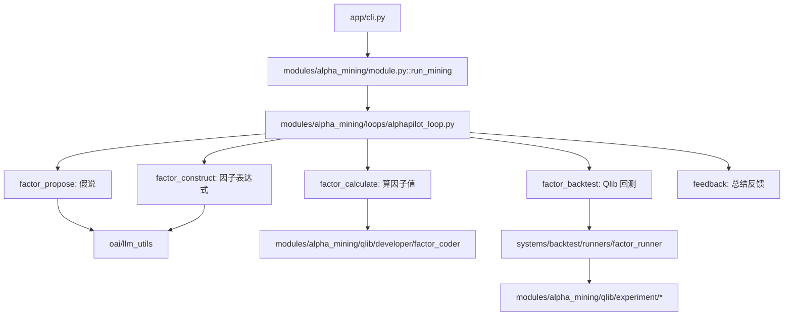
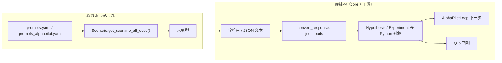

# AlphaPilot 项目与 `alphapilot` 包结构说明

本文档说明 AlphaPilot 项目的整体目标，以及 Python 包 `alphapilot/` 内各目录的职责与主流程调用关系。

**目录**

- [项目整体在做什么](#项目整体在做什么)
- [`alphapilot/` 目录总览](#alphapilot-目录总览)
- [各子目录作用](#各子目录作用)
- [一次 `alphapilot mine` 的代码路径](#一次-alphapilot-mine-的代码路径)
- [core 模块详解：与提示词、大模型输出](#core-模块详解与提示词大模型输出)
- [与项目根目录其他部分的关系](#与项目根目录其他部分的关系)
- [本 fork 相对原版的主要改动](#本-fork-相对原版的主要改动摘要)

---

## 项目整体在做什么

**AlphaPilot** 是一个用 **大模型 + Qlib** 做 **自动因子挖掘** 的 Python 包。核心流程是三个 Agent 协作、循环迭代：

| Agent | 职责 |
|-------|------|
| **Idea Agent** | 根据市场假说提出/改进假设 |
| **Factor Agent** | 把假设变成因子表达式和可执行代码 |
| **Eval Agent** | 用 Qlib 回测，把 IC、收益等结果反馈给下一轮 |

命令行入口在 `pyproject.toml` 中注册为 `alphapilot`，实现在 `alphapilot/app/cli.py`：

| 命令 | 作用 |
|------|------|
| `alphapilot mine` | 主流程：自动挖因子 |
| `alphapilot backtest` | 对已有因子 CSV 做回测 |
| `alphapilot strategy_backtest` | 从 `strategy_zoo` 已保存策略资产复测 |
| `alphapilot strategy_backtest_list` | 列出已保存策略资产 |
| `alphapilot portal` | 统一 Web 门户（数据/因子/策略/回测、挖掘日志、K 线等） |
| `alphapilot ui` | **已弃用**，请使用 `alphapilot portal` →「挖掘日志」 |
| `alphapilot backtest_ui` | **已弃用**，请使用 `alphapilot portal` →「回测 → 回测详情」 |

---

## 内核 + 四大系统架构（可插拔）

为提升扩展性（vnpy 式即插即用），项目在原有代码之上引入了「内核 + 四大系统 + 可插拔模块」分层：

| 层 | 路径 | 职责 |
|----|------|------|
| **内核 kernel** | `alphapilot/kernel/` | `MainEngine` 持有配置与系统/模块；`Context` 是模块访问系统的唯一入口；`AppConfig` 集中路径配置；`registry` 负责内置注册 + 入口点发现 |
| **数据管理系统** | `alphapilot/systems/data/` | 股票数据下载、复权、Qlib 转换、h5 生成与存储（`prepare_data` 实现；`app/data` 已移除） |
| **因子管理系统** | `alphapilot/systems/factor/` | 导入因子、因子库（`FactorDatabase` 包装 `FactorRegulator`）、表达式 DSL |
| **策略管理系统** | `alphapilot/systems/strategy/` | 策略资产落盘（`important_data/strategy_zoo/`）、`backtest_from_asset` 复测编排（经 `strategy/backtest.py` 委托 backtest 系统，不依赖 `alpha_mining` 模块） |
| **策略复测模块** | `alphapilot/modules/strategy_backtest/` | CLI：`strategy_backtest` / `strategy_backtest_list` |
| **交易回测系统** | `alphapilot/systems/backtest/` | 因子/模型回测（统一由 system 内部 qlib workspace 执行）、结果存取（`BacktestResultStore`） |
| **模块 modules** | `alphapilot/modules/` | 可插拔特性；内置 `alpha_mining`、`portal`、`platform`、`data_viz` 等 |
| **Web 门户** | `alphapilot/modules/portal/` | 统一 Streamlit 门户（`alphapilot portal`） |

四大系统通过 `adapters/` 保持外部边界可替换（当前重点为 LLM/数据源）。回测默认由 backtest system 内聚的 qlib 执行链路统一承载；系统服务内部对 qlib/baostock/pandas 采用惰性导入，因此内核装配与命令发现保持轻量。

### 扩展机制

- **内置**：4 系统 + `alpha_mining` 由 `MainEngine.load_builtin()` 注册。
- **第三方**：在 `pyproject.toml` 声明入口点即可被 `MainEngine.discover_plugins()` 自动发现，无需改主仓库：
  - `[project.entry-points."alphapilot.systems"]`：覆盖/新增系统实现
  - `[project.entry-points."alphapilot.modules"]`：注册新模块（模块的 `commands()` 可向 CLI 贡献子命令）

```python
from alphapilot.kernel import build_engine

engine = build_engine()                  # 内置 + 入口点发现
data = engine.get_system("data")         # 数据系统
engine.get_module("alpha_mining")        # 因子挖掘模块
```

---

## `alphapilot/` 目录总览

可将 `alphapilot` 理解为：

- **内核层**：`kernel`（引擎、上下文、配置、注册/发现）
- **系统层**：`systems/{data,factor,strategy,backtest}`（四大能力系统）
- **模块层**：`modules`（可插拔特性，如 `alpha_mining`）
- **框架层**：`core` + `components`
- **业务场景**：`modules/alpha_mining/qlib`
- **应用入口**：`app`
- **基础设施**：`adapters`（LLM + 数据源可插拔；回测引擎固定在 backtest system）、`oai`、`log`、`utils`

### 主流程示意



---

## 各子目录作用

### `systems/data/` — 数据管理系统

| 路径 | 职责 |
|------|------|
| `service.py` | `QlibDataSystem`：对外系统 API，下载走数据源 adapter |
| `prepare_data.py` | `PrepareDataCLI`：`alphapilot prepare_data` 各子命令编排 |
| `prepare_cn.py` | baostock 下载、复权因子刷新 |
| `adjust_prices.py` | 除权 CSV 本地合成前/后复权 |
| `qlib_convert.py` | CSV → Qlib 二进制 |
| `generate_h5.py` | 导出 `daily_pv.h5` |
| `qlib_dump/` | `dump_bin`、未来交易日历 |
| `types.py` | typed DTO（`DataDownloadCommand` 等） |

> 历史路径 `alphapilot/app/data/` 已删除。请统一从 `alphapilot.systems.data` 导入或经 `context.data()` 调用。

### `adapters/` — 外部边界适配层

| 路径 | 职责 |
|------|------|
| `base/` | `BaseLLMAdapter`、`BaseDataSourceAdapter` 及 DTO |
| `builtin/` | 默认 `openai` LLM、`baostock_cn` 数据源 |
| `registry.py` | `LLM_REGISTRY`、`DATA_SOURCE_REGISTRY` |
| `__init__.py` | `get_llm()`、`get_data_source()` |

回测**不**经 adapter。Qlib 执行链路内聚在 `systems/backtest/`（`QlibBacktestSystem`、`QlibFBWorkspace`、pipelines）。接入说明见 [adapters/README.md](../alphapilot/adapters/README.md)。

### `app/` — 命令行与应用入口

| 路径 | 职责 |
|------|------|
| `cli.py` | 加载 `.env`，用 Fire 分发子命令 |
| `cli.py` + `modules/` | `alphapilot mine/backtest/...` 统一走模块分发入口 |
| `modules/backtest_viz/` | Streamlit 回测详情 panel（由 portal 嵌入；产物解析在 `systems/backtest/artifacts.py`） |
| `CI/` | 持续集成相关辅助 |

### `core/` — 抽象框架（与 Qlib 无关的通用骨架）

源自 RD-Agent 的设计，定义「研究循环」里的核心概念：

| 模块 | 职责 |
|------|------|
| `scenario.py` | 场景描述：背景、数据、接口、输出格式（喂给 LLM 的上下文） |
| `proposal.py` | `Hypothesis`、`Trace`、假说生成 / 转实验 / 生成反馈的抽象 |
| `experiment.py` | `Task`、`Workspace`、`Experiment`：一次实验的工作区与任务 |
| `developer.py` | `Developer`：编码器、运行器的统一接口 |
| `evolving_framework.py` / `evolving_agent.py` | 进化式迭代、RAG、知识库 |
| `knowledge_base.py` | 知识库基类 |
| `evaluation.py` | 评估与 `Feedback` |
| `conf.py` | 配置基类，支持环境变量前缀 |
| `exception.py` | `FactorEmptyError`、`CoderError` 等 |
| `prompts.py` / `template.py` | 提示词与代码模板 |

> **延伸阅读**：`core` 并不直接「约束」大模型输出；提示词与 Python 抽象的分工见下文 [core 模块详解](#core-模块详解与提示词大模型输出)。

### `components/` — 可复用组件（跨场景）

| 子目录 | 职责 |
|--------|------|
| `workflow/` | `AlphaPilotLoop`：将 propose → construct → calculate → backtest → feedback 串成循环；`conf.py` 定义配置字段 |
| `coder/factor_coder/` | 因子表达式解析、AST、模板、评测 |
| `coder/model_coder/` | 模型代码生成 |
| `coder/CoSTEER/` | 进化式代码修复策略 |
| `coder/data_science/` | 数据科学流水线占位模块 |
| `proposal/` | 通用 proposal 提示词 |
| `loader/` | 从任务/实验定义加载数据 |
| `document_reader/` | 读 PDF 等文档（研报抽因子用） |
| `knowledge_management/` | 向量库等知识检索 |
| `runner/` | 运行器相关抽象 |
| `benchmark/` | 评测基类与 `TestCase`（`systems/factor/loaders` 等会引用）；因子代码生成批量评测需自写脚本调用 `FactorImplementEval` |

> 历史路径 `alphapilot/app/benchmark/`（手动 `eval.py` / `analysis.py`）已移除，不参与 `mine` / `backtest` CLI。

### `modules/alpha_mining/qlib/` — Qlib 因子/模型场景（本仓库最核心）

把 `core` + `components` 接到 **A 股 / Qlib 回测** 上：

| 子目录 | 职责 |
|--------|------|
| `proposal/` | Idea Agent：生成假说、将假说转为因子表达式 |
| `developer/factor_coder.py` | 解析表达式、生成/执行因子 Python 代码 |
| `systems/backtest/runners/factor_runner.py` | 调用 Qlib 回测，读取 IC、收益等（由 backtest 系统拥有） |
| `developer/feedback.py` | 将回测结果总结为下一轮 prompt |
| `developer/model_coder.py` | 模型训练场景 coder（次要） |
| `systems/backtest/runners/model_runner.py` | 模型 qlib 回测 runner |
| `experiment/factor_experiment.py` | `QlibAlphaPilotScenario`：给 LLM 的场景说明 |
| `experiment/factor_template/` | 内置 Qlib 模板：`conf.yaml`、`conf_cn_combined_kdd_ver.yaml`、`read_exp_res.py` |
| `experiment/template_paths.py` | 解析 `QLIB_FACTOR_QLIB_TEMPLATE_DIR`；默认或自定义目录拷入 workspace |
| `experiment/factor_data_template/` | `generate.py` 导出 `daily_pv.h5` 供因子计算 |
| `experiment/workspace.py` | 每次实验的工作目录 |
| `factor_experiment_loader/` | 从 JSON / PDF 加载已有因子定义 |
| `regulator/` | 因子合规/质量检查 |
| `docker/` | 可选 Docker 回测环境 |
| `prompts_*.yaml` | 各阶段 LLM 提示词 |

#### 默认因子挖掘配置类映射

`modules/alpha_mining/conf.py` 中的 `AlphaPilotFactorBasePropSetting` 将各环节实现类串联如下：

| 配置项 | 默认实现类 |
|--------|------------|
| `scen` | `QlibAlphaPilotScenario` |
| `hypothesis_gen` | `AlphaPilotHypothesisGen` |
| `hypothesis2experiment` | `AlphaPilotHypothesis2FactorExpression` |
| `coder` | `QlibFactorParser` |
| `runner` | `QlibFactorRunner` |
| `summarizer` | `AlphaPilotQlibFactorHypothesisExperiment2Feedback` |
| `qlib_template_dir` | 可选；`.env` → `QLIB_FACTOR_QLIB_TEMPLATE_DIR`，如 `important_data/factor_qlib_templates` |
| `qlib_config_name` | 可选；`.env` → `QLIB_FACTOR_QLIB_CONFIG_NAME`，如 `conf_cn_combined_kdd_ver.yaml` |

单次 `factor_backtest` 时，`QlibFactorRunner`（`systems/backtest/runners/factor_runner.py`）按 `resolve_qlib_config_name()` 选择 yaml；显式配置优先于 `based_experiments` 默认规则。

### `systems/strategy/` — 策略资产与复测

| 路径 | 职责 |
|------|------|
| `service.py` | `register_strategy`、`backtest_from_asset`（`retrain` / `reuse_model`） |
| `backtest.py` | `run_strategy_asset_backtest`：经 `context.backtest()` 调用 `run_factor_evaluation` / `run_saved_model_evaluation` |
| `database.py` | `FileStrategyParamDatabase`：每策略一目录（`factors.json`、`model.json`、`metrics.json`、`artifacts/`、`retests/`） |
| `base.py` | `StrategyRecord`、`StrategyBacktestRequest` 等 DTO |

`AlphaPilotLoop.feedback` 在 mine 每轮成功后调用 `context.strategy().register_strategy(...)`，并在 `metadata` 中记录 `qlib_config_name` / `qlib_template_dir`（若当时有配置）。

### `components/coder/factor_coder/` — 因子代码执行

| 项 | 说明 |
|----|------|
| `config.resolve_factor_python_bin()` | 子进程默认 `sys.executable`；可用 `FACTOR_CoSTEER_PYTHON_BIN` 覆盖 |
| `FactorFBWorkspace.execute` | pickle 缓存**仅保留成功结果**（`df is not None`）；缓存 key 含 python 与数据目录 |

### `oai/` — 大模型调用

| 文件 | 职责 |
|------|------|
| `llm_conf.py` | 模型名、API、超时等（读取 `.env`） |
| `llm_utils.py` | 封装 OpenAI 兼容 API；本 fork 增强了 JSON 解析容错（适配 MiniMax 等） |

### `log/` — 日志与可视化

| 路径 | 职责 |
|------|------|
| `logger.py` / `storage.py` | 结构化记录每轮假说、代码、回测结果 |
| `tag_utils.py` | 日志 tag 规范化；`resolve_scenario_from_log` 从 pickle 恢复 `core.scenario.Scenario` |
| `ui/` | 挖掘日志 Streamlit panel（由 `alphapilot portal` 嵌入；`alphapilot ui` 已弃用） |
| `ui/session.py` | 通过 `Scenario` 的 UI trait（`is_mining_scenario` 等）分支渲染，**不 import** `alpha_mining` 具体场景类 |
| `ui/qlib_report_figure.py` | Qlib 报告图表 |

### `utils/` — 工具

| 路径 | 职责 |
|------|------|
| `agent/tpl.py` | Jinja/YAML 模板渲染（拼接 prompt） |
| `workflow.py` | `LoopBase` / `LoopMeta`，驱动多步循环 |
| `env.py` | 环境相关辅助 |
| `repo/` | 仓库/路径工具 |

---

## 一次 `alphapilot mine` 的代码路径

`AlphaPilotLoop`（`modules/alpha_mining/loops/alphapilot_loop.py`）定义 5 个步骤：

| 步骤 | 方法 | 说明 |
|------|------|------|
| 1 | `factor_propose` | `hypothesis_generator.gen(trace)` → 生成市场假说 |
| 2 | `factor_construct` | `factor_constructor.convert(...)` → 生成多个因子表达式/子任务 |
| 3 | `factor_calculate` | `coder.develop(...)` → 在 `daily_pv.h5` 上计算因子表 |
| 4 | `factor_backtest` | `runner.develop(...)` → Qlib + LightGBM 回测 |
| 5 | `feedback` | `summarizer.generate_feedback(...)` → 写入 `trace`；可选 `register_strategy` 写入 `strategy_zoo` |

相关配置、数据与提示词位于 `modules/alpha_mining/qlib/experiment/` 及各类 `prompts*.yaml`；运行产物默认在 `git_ignore_folder/`（工作区、缓存、日志、策略资产）。

### `alphapilot strategy_backtest` 代码路径

1. `modules/strategy_backtest/module.py` → `StrategySystem.backtest_from_asset`
2. `systems/strategy/backtest.py` → `context.backtest().run_factor_evaluation`（`retrain`）或 `run_saved_model_evaluation`（`reuse_model`）
3. `systems/backtest/pipelines/factor_evaluation.py` → 因子计算 → `QlibFactorRunner` → `qrun`
4. 结果写入 `strategy_zoo/<name>/retests/<时间戳>_<mode>.json`；成功时另导出 `retests/<时间戳>_<mode>/`（`daily_report.csv`、`daily_trades.csv`、`daily_holdings.csv` 等），终端打印 IC 摘要

Mine / backtest / strategy_backtest 共用目录与缓存冲突说明见 [mine-vs-backtest-artifacts.md](mine-vs-backtest-artifacts.md)。

---

## core 模块详解：与提示词、大模型输出

### 一句话结论

| 层次 | 做什么 | 能否保证模型听话 |
|------|--------|------------------|
| **提示词**（`prompts*.yaml`） | 软约束：描述输出格式、任务背景 | 不能 100%，只是「请求」 |
| **`core/` 抽象** | 硬结构：流水线里每一步传什么类型、谁调用谁 | 不直接管模型，管的是 **程序怎么接模型结果** |
| **子类实现**（`modules/alpha_mining/qlib/`、`components/`） | `json.loads` + `convert_response` + 异常重试 | 模型乱写时 **解析失败 / 抛错 / 重试** |

**约束模型输出格式 → 主要靠提示词；`core` 定义的是「接得住模型输出之后，系统长什么样」。**

---

### `core/` 各文件在干什么（不是「约束 LLM」）

#### 1. 流水线骨架（和模型无关的「插槽」）

| 模块 | 作用 |
|------|------|
| `proposal.py` | `Hypothesis`、`Trace`、`HypothesisGen` 等：假说—实验—反馈的数据与三步接口 |
| `developer.py` | `Developer.develop(exp)`：编码 / 回测执行的统一入口（coder、runner 都实现它） |
| `experiment.py` | `Task`、`Experiment`、`Workspace`、`FBWorkspace`：一次实验的任务 + 磁盘工作区 + 执行代码 |
| `scenario.py` | `Scenario`：拼出给 LLM 的 **场景说明**（背景、数据、接口、`output_format` 文本）；并提供 log UI 用的 trait（`is_mining_scenario`、`has_alpha158_baseline`、`uses_qlib_metric_index`），具体 mining 场景在 `modules/alpha_mining/qlib/experiment/` 中覆盖 |
| `evaluation.py` | `Feedback`、`Evaluator`：评估结果的抽象 |

这些是 **面向对象的流水线设计**（来自 RD-Agent），让 `AlphaPilotLoop` 可以写死五步，而 Qlib 因子、模型训练等用不同子类替换。

#### 2. 进化 / 知识（偏 CoSTEER 代码迭代）

| 模块 | 作用 |
|------|------|
| `evolving_framework.py` | `EvolvableSubjects`、`EvolvingStrategy`、`RAGStrategy`：多轮改代码、查知识库 |
| `evolving_agent.py` | 把进化策略串起来 |
| `knowledge_base.py` | 知识库基类 |

用于 **因子/模型代码写错后的迭代修复**，不是假说 JSON 那一步。

#### 3. 基础设施

| 模块 | 作用 |
|------|------|
| `conf.py` | `.env` / 环境变量、工作区路径等配置 |
| `prompts.py` | 从 YAML **加载** 提示词字典（本身不写业务 prompt） |
| `template.py` | 代码模板 |
| `exception.py` | `FactorEmptyError`、`CoderError` 等，控制循环是否跳过 |
| `utils.py` | 单例、`import_class` 等工具 |

---

### 提示词 vs `core`：分工示意



以生成假说为例，实际调用链在 `components/proposal/__init__.py`：

1. 用 Jinja 渲染 `system_prompt` / `user_prompt`，注入 `hypothesis_output_format`（来自 YAML）和 `scenario`（来自 `Scenario`）。
2. `get_llm().chat_completion(..., json_mode=...)`（通过 `alphapilot.adapters` 适配层，底层默认实现仍是 `APIBackend`）
3. **`convert_response(resp)`**：`json.loads` → 填入 `Hypothesis(...)` 各字段。

格式说明在 **prompt** 里；字段形状在 **`Hypothesis` 类**里。模型若少字段、乱 JSON，`convert_response` 会报错，外层可能重试（`MAX_RETRY`）或走 `oai/llm_utils.py` 的 JSON 修复（本 fork 增强）。

---

### 为什么 `Hypothesis` 等要是「固定字段」格式？

不是因为 Python 能约束模型，而是因为 **后续代码必须用结构化数据**：

1. **循环要存历史**：`trace.hist` 是 `(Hypothesis, Experiment, HypothesisFeedback)`，日志、UI、下一轮 prompt 都要按字段取。
2. **模板要填槽**：`hypothesis_and_feedback` 等 Jinja 模板需要 `hypothesis.hypothesis`、`concise_observation` 等固定名字。
3. **类型与可替换性**：`gen() -> Hypothesis`、`convert(hypothesis) -> Experiment` 让整条链路可换实现、可测试。
4. **和 Qlib 解耦**：`core` 不知道 IC、LightGBM；只知道「有一个 Experiment 对象要 `develop`」。

`Scenario.output_format` 也是 **一段会塞进 prompt 的字符串**（常从 YAML 拷到 `QlibAlphaPilotScenario._output_format`），不是运行时 JSON Schema 校验器。

---

### 常见问题

#### `core` 能约束大模型输出吗？

**不能直接约束。** 模型看不到 `Hypothesis` 类定义。

间接手段包括：

- 通过 `Scenario` 把格式说明文本送进 prompt；
- 子类在 `convert_response` 里解析（不守规矩就失败）；
- `json_mode`、重试、`extract_and_validate_llm_json`（在 `oai/`，不在 `core`）。

#### 为什么有多个 `concise_*` 字段？

这是 RD-Agent / AlphaPilot 流程的设计：把 LLM 输出拆成「完整叙述 + 若干简短摘要」，方便：

- 下一轮 prompt 只带 **短摘要**（省 token）；
- 日志和人类阅读；
- 反馈里区分 observation / justification / knowledge。

字段名与 prompt 里的 JSON 说明对齐；对齐发生在 **YAML + `convert_response`**，不是 `core` 自动生成 schema。

#### 约束输出不该只靠提示词吗？

**只靠提示词不够**：

| 仅靠 prompt | 加上 `core` + 解析代码 |
|-------------|------------------------|
| 模型仍可能漏字段、加 markdown、尾逗号 | `json.loads` + 容错函数可检测/修复 |
| 无法驱动 Python 回测 | 必须变成 `Experiment` / `Workspace` |
| 难以做 5 步循环、断点续跑 | `Trace`、`LoopBase` 需要稳定对象 |
| 换 Qlib / 换场景要改整条链 | 只换 `scenarios` 子类，`core` 不变 |

更准确的说法：

- **提示词** = 对模型的 **软约束**（希望它怎么写）
- **`core` 类型** = 对程序的 **硬契约**（接下去每一步假定有什么数据）
- **`convert_response` / `regulator` / `expr_parser`** = **软约束失败后的补救与校验**

---

### `proposal.py` 在其中的位置

`proposal.py` 是 `core` 里最贴近「LLM 研究循环」的一块：

| 概念 | 角色 |
|------|------|
| `Hypothesis` / `HypothesisFeedback` | 内存里的数据结构（不是 prompt） |
| `HypothesisGen` 等 | 接口；真正实现里会调 LLM + prompt |
| `Trace` | 多轮 `(假说, 实验, 反馈)` 历史 |

它不是「另一种提示词」，而是 **「提示词 + 模型」之后，系统内部用的标准件**。

与 `AlphaPilotLoop` 的对应关系：

```
Trace（历史）
    ↓
HypothesisGen.gen()                    → Hypothesis
    ↓
Hypothesis2Experiment.convert()        → Experiment
    ↓
（coder / runner 执行，不在 proposal.py）
    ↓
HypothesisExperiment2Feedback.generate_feedback() → HypothesisFeedback
    ↓
写入 trace.hist，下一轮再用
```

---

### 想改行为时应该改哪里

| 目标 | 建议修改位置 |
|------|--------------|
| 让模型多输出一个字段 | YAML 的 `hypothesis_output_format` + 子类 `convert_response` + 必要时扩展 `Hypothesis` |
| 改挖掘流程几步、换组件 | `core` 接口 + `conf.py` 类名 + `alphapilot_loop.py` |
| 改 Qlib 回测、因子表达式 | `modules/alpha_mining/qlib/`，一般不动 `core` |
| 模型 JSON 经常坏 | `oai/llm_utils.py`、重试配置 |

---

## 与项目根目录其他部分的关系

| 位置 | 与 `alphapilot` 的关系 |
|------|------------------------|
| `alphapilot/systems/data/` | 数据准备核心实现（原 `app/data` 与根目录脚本能力已收拢至此） |
| `requirements.txt` / `pyproject.toml` | 安装 `alphapilot` 包并注册 CLI |
| `.env` | API Key、`USE_LOCAL`、`QLIB_FACTOR_*`、`FACTOR_CoSTEER_*` 等，由 `cli.py` 与各 `*PropSetting` 读取 |
| `important_data/factor_qlib_templates/` | 用户自定义 Qlib 模板副本（可选） |
| `important_data/strategy_zoo/` | mine 策略资产与复测记录 |
| `important_data/stock_lists/` | 股票池 CSV 等；`prepare_data` 默认列表为 `main_stock_2026_4_27.csv` |
| `.github/` | GitHub Actions、Dependabot、Issue/PR 模板（本地开发通常无影响） |

---

## 本 fork 相对原版的主要改动（摘要）

1. **LLM JSON 容错**（`oai/llm_utils.py`）：适配非标准 JSON 输出  
2. **回测可视化**（`modules/backtest_viz/` + `systems/backtest/artifacts.py`）：`alphapilot backtest_viz` / portal  
3. **数据准备**（`systems/data/`）：baostock 下载 A 股数据、Qlib 转换与 h5 导出  
4. **回测配置**：内置 `factor_template/` + 可选 `important_data/factor_qlib_templates/`；`QLIB_FACTOR_QLIB_TEMPLATE_DIR` / `QLIB_FACTOR_QLIB_CONFIG_NAME`  
5. **策略资产复测**（`modules/strategy_backtest/` + `systems/strategy/backtest.py` → `context.backtest()`）：`strategy_backtest` / `strategy_backtest_list`  
6. **挖掘日志 UI 解耦**（`log/ui/`）：通过 `core.scenario.Scenario` UI trait 渲染，不依赖 `alpha_mining` 具体场景类  
7. **因子执行环境**：`FACTOR_CoSTEER_PYTHON_BIN` 默认当前解释器；失败 execute 不写入 pickle 缓存  
8. **Adapter 层收敛**（`adapters/`）：移除未使用的 backtest engine adapter；仅保留 LLM + 数据源可插拔，回测固定在 `systems/backtest/`

更完整的使用说明见项目根目录 [README.md](../README.md)。
