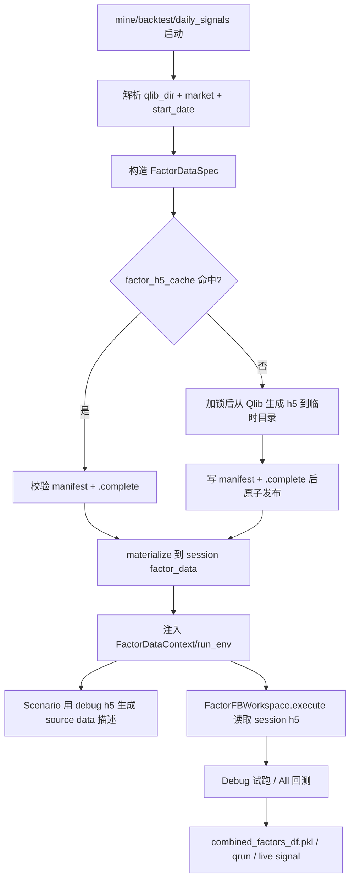

# Factor H5 生命周期优化方案

## 背景

当前因子计算依赖 `daily_pv.h5`。它从 Qlib 数据导出，包含指定 `market` 的日频价量数据，供因子表达式执行、因子回测和每日信号计算使用。

现有实现把 h5 放在全局目录：

- `git_ignore_folder/factor_implementation_source_data/daily_pv.h5`
- `git_ignore_folder/factor_implementation_source_data_debug/daily_pv.h5`

这个设计在单任务、固定股票池下可用，但当用户频繁切换股票池、并行运行多个挖掘任务，或希望让回测与挖掘绑定自己的数据快照时，会产生数据错配和并发污染风险。

本文分析当前代码路径，并提出将 h5 管理从“全局共享文件”优化为“任务级数据上下文 + market 级物理缓存”的方案。

## 当前代码路径

### h5 生成

`alphapilot/systems/data/generate_h5.py` 中的 `generate_daily_pv_h5()` 负责从 Qlib 导出数据：

- 通过 `D.instruments(market=market)` 读取股票池。
- 导出字段为 `$open`, `$close`, `$high`, `$low`, `$volume`。
- 额外计算 `$return`。
- 输出 `daily_pv_all.h5` 和 `daily_pv_debug.h5`。

当前 debug 数据会再次调用一次 `D.features()`，实际上可以直接从全量 dataframe 切片得到。

### h5 同步到全局目录

`alphapilot/components/coder/factor_coder/data.py` 中：

- `generate_data_folder_from_qlib()` 先生成模板 h5，再复制到全局 `FACTOR_COSTEER_SETTINGS.data_folder*`。
- `ensure_factor_data()` 只检查两个目录是否存在，存在即返回，不会检查 `daily_pv.h5` 是否存在、是否匹配当前 `market`、是否过期。
- `get_data_folder_intro()` 始终从全局 debug 目录读取 h5 元信息，作为 LLM 的 source data 描述。

### 因子执行

`alphapilot/components/coder/factor_coder/factor.py` 中 `FactorFBWorkspace.execute()`：

- `execute("Debug")` 使用 `FACTOR_COSTEER_SETTINGS.data_folder_debug`。
- `execute("All")` 使用 `FACTOR_COSTEER_SETTINGS.data_folder`。
- 每次执行前都会把该目录下文件软链到当前因子 workspace。
- `factor.py` 或 execution template 在 workspace 内读取 `./daily_pv.h5`。

因此，一个挖掘任务启动后，并不是只读取一次 h5；每轮、每个因子执行时都会重新链接并读取。如果另一个任务中途覆盖全局 h5，前一个任务后续因子可能读到新的股票池。

### 挖掘与回测入口

`alphapilot/modules/alpha_mining/module.py` 中 `run_mining()` 负责创建 `AlphaPilotLoop`，但没有在入口按本次 `market` 构建 h5。

`alphapilot/modules/alpha_mining/loops/alphapilot_loop.py` 中：

- `factor_calculate()` 通过 `self.coder.develop()` 计算候选因子。
- `factor_backtest()` 把实验交给 `context.backtest().run_factor_experiment()`。

`alphapilot/systems/backtest/pipelines/factor_evaluation.py` 中 `_build_experiment()` 会调用 `ensure_factor_data()`，但这仍然是全局目录检查。

### 回测合并因子

`alphapilot/systems/backtest/runners/factor_runner.py` 中：

- `process_factor_data()` 对每个 factor workspace 调用 `implementation.execute("All")`。
- 因此回测阶段会读取全局全量 h5。
- `get_cache_key()` 当前包含任务信息、qlib config、template dir、use_local、pretrained 和 yaml params，但没有包含 h5 指纹。

### 每日交易信号

`alphapilot/systems/backtest/live/predict.py` 中：

- `latest_factor_date()` 直接读取全局 h5 判断因子数据最新日期。
- `compute_combined_factors()` 调用 `ensure_factor_data()` 后重新计算组合因子。

这意味着 live signal 当前也不绑定某个策略训练时的数据快照，而是依赖“当前全局 h5”。

## 当前设计问题

| 问题 | 影响 |
| --- | --- |
| 全局 h5 被所有任务共享 | 不同股票池的挖掘/回测并行运行时会互相污染 |
| `ensure_factor_data()` 只看目录是否存在 | 股票池变更、h5 文件缺失、h5 过期都可能被跳过 |
| LLM source data 描述读取全局 debug h5 | LLM 看到的数据结构可能与本次任务实际数据不一致 |
| pickle 缓存不包含 h5 内容或 market 指纹 | 换股票池后可能命中旧因子结果 |
| `prepare_data h5` 与实际因子运行目录割裂 | 生成模板 h5 后仍需同步到全局目录，容易遗漏 |
| debug h5 重复从 Qlib 读取 | 构建耗时不必要增加 |
| daily signals 依赖全局 h5 | 交易信号可能与策略训练/回测时的数据上下文不一致 |

## 目标

1. 挖掘、回测、每日信号应使用与本次 `market` 一致的 h5。
2. 不同任务即使并行运行，也不能互相覆盖 h5。
3. 避免每个因子 workspace 重复导出 h5。
4. 保留同一 `market` 的 h5 复用能力，降低构建成本。
5. 让 LLM prompt、因子执行、回测缓存、daily signals 使用同一份数据指纹。
6. 兼容旧的全局 h5 路径，便于渐进迁移。

## 推荐架构

推荐采用：

> 任务级逻辑隔离 + market/spec 级物理缓存。

不要为每个因子子 workspace 单独生成 h5。因子挖掘一轮可能生成多个因子，如果每个子 workspace 都从 Qlib 导出，会造成巨大重复开销。

建议粒度如下：

| 粒度 | 是否推荐 | 原因 |
| --- | --- | --- |
| 全局一份 h5 | 不推荐 | 多任务、多股票池互相污染 |
| 每个因子 workspace 一份 h5 | 不推荐 | 重复导出，磁盘和耗时都高 |
| 每个挖掘/回测 session 一份逻辑数据目录 | 推荐 | 任务隔离，生命周期清晰 |
| 每个 market/spec 一份物理缓存 | 推荐 | 避免重复构建，支持并发复用 |

### 目录结构

建议新增缓存目录：

```text
git_ignore_folder/
  factor_h5_cache/
    <spec_hash>/
      daily_pv.h5
      daily_pv_debug.h5
      README.md
      manifest.json
      .complete
```

每个任务 workspace 只保留指向缓存的任务级数据目录：

```text
git_ignore_folder/
  RD-Agent_workspace/
    <experiment_id>/
      factor_data/
        all/
          daily_pv.h5 -> ../../../factor_h5_cache/<spec_hash>/daily_pv.h5
          manifest.json -> ../../../factor_h5_cache/<spec_hash>/manifest.json
        debug/
          daily_pv.h5 -> ../../../factor_h5_cache/<spec_hash>/daily_pv_debug.h5
          manifest.json -> ../../../factor_h5_cache/<spec_hash>/manifest.json
      combined_factors_df.pkl
      ret.pkl
```

现有因子脚本固定读取 `./daily_pv.h5`，所以 session 下需要区分 `all/` 和 `debug/` 两个目录，并在两个目录中都暴露名为 `daily_pv.h5` 的文件。每个因子 workspace 执行时，再把对应目录软链到自己的 workspace：

```text
git_ignore_folder/
  RD-Agent_workspace/
    <factor_workspace_id>/
      daily_pv.h5 -> ../<experiment_id>/factor_data/all/daily_pv.h5
```

实际实现时可以不强制要求 factor workspace 在 experiment workspace 下面，只要 `FactorDataContext` 中记录绝对路径即可。

## 核心抽象

### FactorDataSpec

用于描述一份 h5 的输入参数：

```python
@dataclass(frozen=True)
class FactorDataSpec:
    qlib_dir: Path
    market: str
    start_date: str = "2015-01-01"
    fields: tuple[str, ...] = ("$open", "$close", "$high", "$low", "$volume")
    debug_stock_count: int = 100
```

`spec_hash` 应至少包含：

- `qlib_dir` 的规范化路径。
- `market`。
- `start_date`。
- `fields`。
- `debug_stock_count`。
- `instruments/{market}.txt` 内容 hash。
- h5 生成器版本。

如果后续要更严格，可加入 Qlib feature 文件的最大 mtime 或数据源版本戳。

### FactorDataManifest

缓存目录中的 `manifest.json` 记录：

```json
{
  "spec_hash": "...",
  "market": "main_stock_2026_4_27",
  "qlib_dir": "~/.qlib/qlib_data/cn_data/baostock/qlib",
  "start_date": "2015-01-01",
  "fields": ["$open", "$close", "$high", "$low", "$volume"],
  "debug_stock_count": 100,
  "instruments_hash": "...",
  "daily_pv_size": 123456789,
  "daily_pv_mtime_ns": 123456789,
  "generated_at": "2026-06-20T16:00:00+08:00"
}
```

缓存是否有效不应只看目录存在，而应检查：

- `daily_pv.h5` 存在。
- `daily_pv_debug.h5` 存在。
- `manifest.json` 存在。
- `.complete` 存在。
- 当前 spec hash 与 manifest 一致。

### FactorDataContext

运行时在 mine/backtest/live 之间传递的数据上下文：

```python
@dataclass(frozen=True)
class FactorDataContext:
    spec: FactorDataSpec
    cache_dir: Path
    session_dir: Path
    data_dir: Path
    debug_dir: Path
    fingerprint: str
```

建议通过两种方式传递：

1. Python 对象：挂到 `scenario` / `experiment` / `workspace`。
2. `run_env`：用于跨进程、Docker 或 qrun。

建议环境变量：

```text
ALPHAPILOT_FACTOR_DATA_DIR=/abs/path/to/session/factor_data/all
ALPHAPILOT_FACTOR_DATA_DEBUG_DIR=/abs/path/to/session/factor_data/debug
ALPHAPILOT_FACTOR_DATA_FINGERPRINT=<spec_hash>
ALPHAPILOT_FACTOR_DATA_MARKET=<market>
```

## 新流程



## 入口改造

### 挖掘入口

在 `AlphaMiningModule.run_mining()` 中，新增 `market` 和 `factor_data_policy` 参数：

```python
def run_mining(
    ...,
    market: str | None = None,
    factor_data_policy: str = "cache",
) -> None:
```

`market` 解析优先级：

1. CLI 显式 `--market`。
2. `yaml_params` 或 qlib template 中的 `market`。
3. `qlib_config_name` 指向的 yaml 中的 `market`。
4. 默认股票池 `DEFAULT_STOCK_CSV` 的文件名。

启动 loop 前执行：

```python
factor_data_ctx = context.data().prepare_factor_h5_context(
    market=resolved_market,
    qlib_dir=resolved_qlib_dir,
    session_hint="mine",
)
```

然后传给 `AlphaPilotLoop`，并写入 `loop.factor_data_context`，用于恢复和续跑。

### 因子回测入口

在 `FactorBacktestRequest` 和 `FactorExperimentBacktestRequest` 中增加可选字段：

```python
market: str | None = None
factor_data_dir: str | Path | None = None
factor_data_fingerprint: str | None = None
```

`factor_data_dir` 用于复用已有 session 的 h5；没有传入时按 `market` 构建或命中缓存。

`FactorBacktestPipeline._build_experiment()` 不再直接调用旧的 `ensure_factor_data()`，而是准备 `FactorDataContext` 并挂到：

- `scenario.factor_data_context`
- `experiment.factor_data_context`
- `experiment.run_env`

### 每日交易信号

`latest_factor_date()` 和 `compute_combined_factors()` 应支持显式 `factor_data_dir`：

```python
def latest_factor_date(*, factor_data_dir: str | Path | None = None, use_local: bool = True) -> str | None:
```

策略资产保存时，应记录训练/回测所用的：

- `market`
- `factor_data_fingerprint`
- `qlib_config_name`
- `qlib_template_dir`

daily signals 运行时优先使用策略资产绑定的数据上下文；如果缓存缺失，可按 manifest/spec 重建。

## 执行器改造

### 解析数据目录

`FactorFBWorkspace.execute()` 当前只读全局 `FACTOR_COSTEER_SETTINGS`。建议新增解析函数：

```python
def resolve_factor_data_dir(workspace: FactorFBWorkspace, data_type: str) -> Path:
    ctx = getattr(workspace, "factor_data_context", None)
    if ctx is not None:
        return ctx.debug_dir if data_type == "Debug" else ctx.data_dir

    run_env = getattr(workspace, "run_env", None) or {}
    if data_type == "Debug" and run_env.get("ALPHAPILOT_FACTOR_DATA_DEBUG_DIR"):
        return Path(run_env["ALPHAPILOT_FACTOR_DATA_DEBUG_DIR"])
    if run_env.get("ALPHAPILOT_FACTOR_DATA_DIR"):
        return Path(run_env["ALPHAPILOT_FACTOR_DATA_DIR"])

    # fallback for compatibility
    return Path(
        FACTOR_COSTEER_SETTINGS.data_folder_debug
        if data_type == "Debug"
        else FACTOR_COSTEER_SETTINGS.data_folder
    )
```

为了让 workspace 拿到上下文，推荐在 `FactorCoder` 生成 `FactorFBWorkspace` 后统一注入 `factor_data_context`，或者在 `Experiment` 生成 `sub_workspace_list` 后批量注入。

### 缓存 key

`FactorFBWorkspace.hash_func()` 应加入 h5 指纹：

```python
fingerprint = resolve_factor_data_fingerprint(self)
return md5_hash(
    data_type
    + self.code_dict["factor.py"]
    + resolve_factor_python_bin()
    + fingerprint
)
```

`QlibFactorRunner.get_cache_key()` 也应加入：

- `factor_data_fingerprint`
- `market`
- `qlib_dir`

否则换股票池后可能复用旧的 `combined_factors_df.pkl` 或旧的 factor result。

## h5 生成优化

### 避免 debug 二次读取 Qlib

当前 `generate_daily_pv_h5()` 为 debug 数据再次调用 `D.features()`。可以改为：

```python
debug_instruments = data.index.get_level_values("instrument").unique()[:debug_stock_count]
debug_data = data.loc[pd.IndexSlice[:, debug_instruments], :].sort_index()
```

注意当前 dataframe 的 index 顺序是 `datetime, instrument`，需要按实际 index levels 写切片。

### 原子写入

缓存构建时不要直接写目标目录。建议：

1. 写入 `factor_h5_cache/.tmp-<spec_hash>-<pid>/`。
2. 校验两个 h5 可以被 `pd.read_hdf(..., key="data")` 打开。
3. 写入 `manifest.json`。
4. 写入 `.complete`。
5. 原子 rename 到 `<spec_hash>/`。

如果目标目录已存在且 `.complete` 有效，直接删除临时目录。

### 文件锁

对同一个 `spec_hash` 使用 `FileLock`：

```text
git_ignore_folder/factor_h5_cache/<spec_hash>.lock
```

这样两个任务同时请求同一 market 时，只有一个任务构建，另一个等待后复用缓存。

### 软链优先

全量 h5 可能很大，任务目录应该优先 symlink，不应 copy。Windows 下可以沿用现有 hardlink 逻辑。

## 数据职责边界

建议调整职责：

| 模块 | 新职责 |
| --- | --- |
| `prepare_data download/convert` | 维护 CSV、Qlib binary、instruments |
| `prepare_data h5` | 保留为手动数据诊断/预热缓存命令 |
| mine/backtest/live | 启动时按本次 `market` 确保 h5 context 可用 |
| factor coder | 只消费 `FactorDataContext`，不决定 `market` |
| strategy asset | 保存训练/回测时的 `market` 与 `factor_data_fingerprint` |

这意味着 h5 不再是“准备数据后用户必须手动同步的全局副本”，而是因子相关任务的运行依赖，由任务入口自动准备。

## 兼容策略

为了降低改造风险，建议分阶段迁移。

### 阶段 1：新增上下文，不移除全局路径

- 新增 `FactorDataSpec` / `FactorDataContext` / cache manager。
- `FactorFBWorkspace.execute()` 优先读 context/env，读不到再 fallback 到全局路径。
- `get_data_folder_intro()` 支持传入 `data_folder_debug`，默认仍走旧全局目录。
- `FactorBacktestRequest` 新增可选 `market` / `factor_data_dir` 字段。

这个阶段可以保持旧命令全部可用。

### 阶段 2：mine/backtest 默认启用任务级 h5

- `run_mining()` 和 `FactorBacktestPipeline._build_experiment()` 默认 prepare `FactorDataContext`。
- CLI 增加 `--market`。
- 日志明确输出 `market`, `spec_hash`, `factor_data_dir`。
- pickle cache key 加入 `factor_data_fingerprint`。

### 阶段 3：daily signals 绑定策略数据上下文

- 策略资产保存 `market` / `factor_data_fingerprint`。
- `daily_signals` 优先使用策略资产绑定的 h5 cache。
- 如果 h5 stale，提示重建对应 spec，而不是提示刷新全局 h5。

### 阶段 4：弱化全局 h5

- `git_ignore_folder/factor_implementation_source_data*` 只作为旧兼容 fallback。
- 文档推荐用户不再手动复制 `daily_pv_all.h5` 到全局目录。
- `prepare_data h5` 改为“预热 factor h5 cache”，或增加参数 `--cache True`。

## 推荐落地顺序

1. 新增 `alphapilot/systems/data/factor_h5.py`，实现 spec、manifest、cache、materialize。
2. 改造 `generate_daily_pv_h5()`，支持输出 `daily_pv.h5` / `daily_pv_debug.h5`，并从全量切 debug。
3. 改造 `get_data_folder_intro()`，允许显式传入 debug h5 目录。
4. 改造 `FactorFBWorkspace.execute()`，优先读取 `FactorDataContext` 或 env。
5. 在 `FactorBacktestPipeline._build_experiment()` 注入任务级 h5。
6. 在 `AlphaMiningModule.run_mining()` 注入任务级 h5，并持久化到 loop。
7. 将 h5 指纹加入因子执行缓存和回测缓存。
8. 最后改造 daily signals 和 strategy asset。

## 风险与对策

| 风险 | 对策 |
| --- | --- |
| 首次按 market 构建 h5 耗时较长 | 使用 market/spec cache，后续任务软链复用 |
| 缓存占用磁盘 | 提供 `alphapilot clean_factor_h5_cache` 或 Portal 清理入口 |
| instruments 已改但 cache 未失效 | spec hash 纳入 instruments 文件内容 hash |
| Qlib feature 内容变了但 instruments 未变 | 在 manifest 中记录 qlib feature 最大 mtime，或由 refresh/convert 明确标记 cache stale |
| 并发构建同一 spec | 使用 `FileLock` 和临时目录原子发布 |
| 旧任务恢复时找不到 h5 | loop/experiment 持久化 `FactorDataSpec`，cache 缺失时可重建 |
| Docker 模式路径不可见 | 将 session `factor_data` 目录 mount 到容器，并通过 env 传入容器内路径 |
| 缓存 key 变更导致旧缓存失效 | 这是预期行为；可保留旧 fallback，但新任务必须按 fingerprint 缓存 |

## 最终建议

可以把 h5 构建归入挖掘、回测、daily signals 等因子相关任务的生命周期中，但不要让每个因子 workspace 各自构建 h5。最优方案是：

1. 任务启动时解析本次 `market`。
2. 根据 `market + qlib_dir + start_date + fields + instruments hash` 构造 `FactorDataSpec`。
3. 在 `factor_h5_cache/<spec_hash>/` 中复用或构建物理 h5。
4. 在本次任务 workspace 下 materialize 一个 `factor_data/` 逻辑目录。
5. LLM prompt、因子执行、回测、live signal 都从同一个 `FactorDataContext` 读取。
6. h5 指纹进入所有相关 pickle cache key。

这个方案既解决全局 h5 的并发污染，又避免每个任务从零重复构建数据，是当前代码结构下较稳妥的演进路径。

## 实现说明（As-built）

实际落地相对上文方案做了几处简化/修正：

1. **取消独立的 session 软链层。** 由于 spec 缓存按内容寻址（`spec_hash`）且不可变，已天然隔离。直接把 `all/` 与 `debug/` 子目录放进缓存目录，因子 workspace 经现有 `link_all_files_in_folder_to_workspace()` 直接软链到 `<spec_hash>/all`（或 `/debug`）中的 `daily_pv.h5`。目录结构：

   ```text
   git_ignore_folder/factor_h5_cache/<spec_hash>/
     all/   { daily_pv.h5, README.md }
     debug/ { daily_pv.h5, README.md }
     manifest.json
     .complete
   ```

2. **`manifest.json` / `.complete` 只放在 `<spec_hash>/` 根。** `factor_coder/data.py:get_file_desc` 对非 `.h5`/`.md` 文件会 `raise NotImplementedError`，而 `get_data_folder_intro()` 会遍历 debug 目录；把 json 放进 `debug/` 会让 LLM source-data 描述崩溃，故 `all/`、`debug/` 只含 h5 + README。

3. **上下文传递用「workspace 属性 + 进程 env」双通道，不再单独 materialize 逻辑目录。** 任务入口（`run_mining` / `_build_experiment` / `generate_daily_signal`）调用 `prepare_factor_data_context()` 后 `apply_context_env()` 写入 `ALPHAPILOT_FACTOR_DATA_*`；解析优先级为 `workspace.factor_data_context` → env → 旧全局目录。`process_factor_data` 会把 context 注入每个 sub_workspace（随 multiprocessing pickling 传到子进程），env 则覆盖 spawn 子进程与 qrun。`get_data_folder_intro` 也读 env，使 scenario 的 source-data 描述自动对齐本次数据。

4. **修复 `$return` bug。** 旧代码 `groupby(level=0)`（level 0 是 `datetime`）在「同一天不同股票间」做 pct_change，数值无意义；改为 `groupby(level="instrument")`，并由全量 frame 切片得到 debug（去掉第二次 `D.features` 调用）。`GENERATOR_VERSION` 纳入 `spec_hash`，生成逻辑变更即自动失效旧缓存。

5. **缓存键。** `FactorFBWorkspace.hash_func()` 与 `QlibFactorRunner.get_cache_key()` 加入 `factor_data_fingerprint`（无 context/env 时回退旧字符串，保持旧缓存兼容）。

6. **策略资产绑定。** `train_and_register` 把训练时的 `market` / `factor_data_fingerprint` 写入 `metadata`；`daily_signals` 与 `backtest_from_asset`（retrain/reuse_model）读回 `market` 重建/复用对应 spec 的缓存。

7. **运维。** 新增 `prepare_data h5`（预热缓存）与 `prepare_data clean_h5_cache [--market]`（清理缓存）命令；`clean_factor_h5_cache()` 同时清理残留的 `.tmp-*` 目录与 `.lock` 文件。

**已知限制**：`apply_context_env` 写的是进程级 `os.environ`；若在**同一进程**内并发跑两个不同 market 的挖掘任务，env 可能互相覆盖（数据不会损坏——每个 market 各自有不可变缓存目录——但 LLM source-data 描述可能取到另一任务的 debug 目录）。回测/因子执行路径已用 workspace 属性优先级规避此问题；彻底的多 market 并发请用独立进程，或后续把 context 直接注入 scenario 构造函数。

**验证**：`tests/test_factor_h5.py` 覆盖 spec 哈希、原子构建、manifest 布局、缓存命中、reuse、env 解析优先级、清理与 `$return` 修复（不依赖 qlib/HDF5）。涉及 qlib 的端到端（真实 h5 生成、mine/backtest/daily_signals、完整 pytest）需在可用的 qlib 环境中运行。
