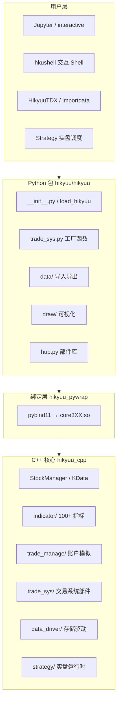
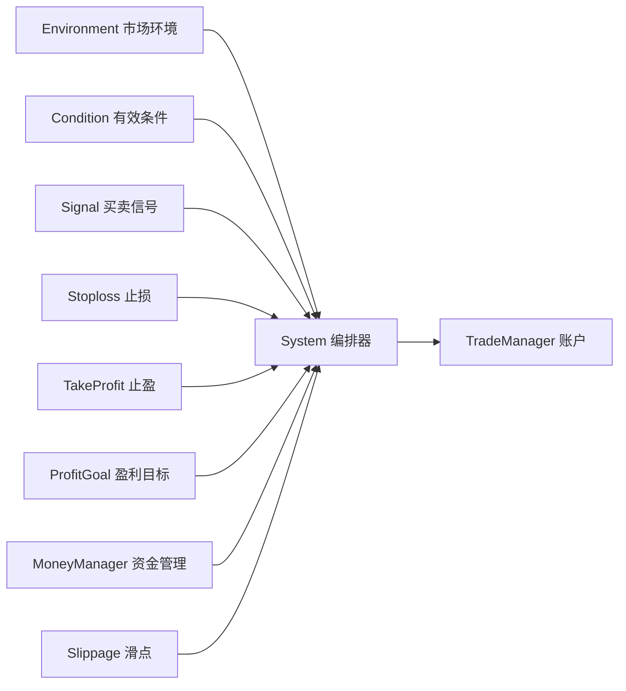

# Hikyuu 项目模块、用法与实现解析

本文档说明 [Hikyuu](https://hikyuu.org/) 量化框架的模块划分、使用路径与实现原理。Hikyuu 源码位于本仓库 `hikyuu/` 子目录（已在 `.gitignore` 中忽略，为独立 clone），与 AlphaPilot 并存、无直接代码耦合。

**目录**

- [项目简介](#项目简介)
- [整体架构](#整体架构)
- [顶层目录总览](#顶层目录总览)
- [Python 包模块详解](#python-包模块详解)
- [C++ 核心模块详解](#c-核心模块详解)
- [交易系统部件（trade_sys）](#交易系统部件trade_sys)
- [组合与多因子](#组合与多因子)
- [使用指南](#使用指南)
- [实现原理](#实现原理)
- [与 AlphaPilot 的关系](#与-alphapilot-的关系)
- [关键文件索引](#关键文件索引)
- [参考链接](#参考链接)

---

## 项目简介

**Hikyuu Quant Framework** 是一款基于 C++/Python 开发的开源超高速量化研究框架，深度适配 A 股市场数据体系，核心能力覆盖：

| 方向 | 说明 |
|------|------|
| 策略建模 | 将系统化交易拆解为可组合部件（环境、信号、资金管理等） |
| 量化模拟回测 | `System` 逐 K 线编排部件，`TradeManager` 记账 |
| 金融数据分析 | 100+ 内置指标、TA-Lib 桥接、pandas 互转 |
| 实盘扩展 | `Strategy` 定时调度 + 实时行情（QMT 等合规终端） |

项目由三大部分构成：

1. **hikyuu_cpp** — C++20 高性能核心库
2. **hikyuu_pywrap** — pybind11 绑定层，编译为 `hikyuu/cpp/core{版本}.so`
3. **hikyuu** — Python 用户 API、GUI、数据工具、示例

官方文档：[https://hikyuu.readthedocs.io/zh-cn/latest/index.html](https://hikyuu.readthedocs.io/zh-cn/latest/index.html)

---

## 整体架构



**数据流概览：**

1. 用户通过 Jupyter / Shell / GUI 调用 Python API
2. Python 层通过 `core.py` 加载对应版本的 `.so` 绑定模块
3. C++ 核心完成 K 线读取、指标计算、回测编排、账户记账
4. 结果通过 pybind 返回 Python，可用 pandas 进一步分析或 `draw` 可视化

---

## 顶层目录总览

| 目录 | 职责 |
|------|------|
| `hikyuu/hikyuu/` | Python 用户 API、GUI、数据工具、Jupyter 示例 |
| `hikyuu/hikyuu_cpp/` | C++20 高性能引擎（指标、回测、数据驱动、策略运行时） |
| `hikyuu/hikyuu_pywrap/` | pybind11 绑定，编译产物安装到 `hikyuu/cpp/` |
| `hikyuu/docs/` | Sphinx 文档（安装、快速入门、各模块 API） |
| `hikyuu/test_data/` | 示例行情数据（vipdoc、板块等） |
| `hikyuu/docker/` | 开发用 Docker 镜像 |
| `hikyuu/setup.py` + `xmake.lua` | 源码编译（xmake 构建 C++，再安装 Python 包） |
| `hikyuu/sub_setup.py` | PyPI 发布（`pip install hikyuu`） |

---

## Python 包模块详解

Python 包路径：`hikyuu/hikyuu/`。主入口 `__init__.py` 导入各子模块，创建全局 `sm = StockManager.instance()`，并注入命令行风格指标别名（`O, C, H, L, V, A`）。

| 子目录 / 文件 | 职责 |
|---------------|------|
| `__init__.py` | 主入口；`load_hikyuu()` 初始化；`select()` 选股；`realtime_update()` 实时行情 |
| `core.py` | 按 Python 小版本动态 `import core310` / `core312` 等 |
| `extend.py` | Python 侧扩展：`KData.to_df()`、Datetime/Stock 哈希、pandas 互转 |
| `interactive.py` | 交互式一键加载：`from hikyuu.interactive import *` |
| `hub.py` | 策略部件库管理器，从 [hikyuu_hub](https://gitee.com/fasiondog/hikyuu_hub) 拉取社区部件 |
| `data/` | HDF5/MySQL/SQLite/ClickHouse 导入导出、配置模板（`hku_config_template.py`） |
| `indicator/` | 指标 Python 辅助、自定义指标注册（`pyind.py`） |
| `trade_manage/` | 交易记录 pandas 辅助、`OrderBroker` 邮件/券商适配 |
| `trade_sys/` | 部件工厂函数：`crtCN`, `crtEV`, `crtSG`, `crtMM`, `crtST`, `crtPG`, `crtSP` 等 |
| `analysis/` | 指标/系统组合分析（`combinate_ind_analysis`） |
| `draw/` | K 线与指标绘图（matplotlib / bokeh） |
| `fetcher/` | 实时行情抓取：新浪/QQ、QMT、东方财富板块 |
| `gui/` | `HikyuuTDX` 数据下载 GUI、`importdata` CLI、`dataserver` 行情中继 |
| `shell/` | 彩色交互 Shell + HTTP 命令服务（`127.0.0.1:520`） |
| `strategy/` | 实盘策略示例（`strategy_demo1.py` 等） |
| `plugin/` | 可选 `hikyuu_plugin` 私有扩展占位 |
| `examples/notebook/` | Jupyter 教程（`000-Index.ipynb` 起） |
| `cpp/` | 编译后的 `.so` / `.dll` 及 i18n 文件（非源码） |

### 初始化流程

`load_hikyuu()` 的核心步骤：

1. 读取 `~/.hikyuu/hikyuu.ini`（不存在则按模板生成默认 HDF5 配置）
2. 调用 `StockManager.init()` 装配数据驱动（baseinfo / block / kdata）
3. 按配置 preload 指定 K 线类型与数量
4. 设置全局板块变量（`blocka`, `zsbk_hs300` 等）
5. 可选启动实时行情代理（`start_spot=True`）

```python
# 交互式（Jupyter 推荐）
from hikyuu.interactive import *

# 程序化（自定义程序）
from hikyuu import *
load_hikyuu(stock_list=['sh000001'], ktype_list=['day'], start_spot=False)
```

---

## C++ 核心模块详解

C++ 核心路径：`hikyuu_cpp/hikyuu/`。

### 基础类型

| 文件 | 职责 |
|------|------|
| `Stock.h/cpp`, `StockManager.h/cpp` | 证券注册表、K 线访问、preload 缓存 |
| `KData.h/cpp`, `KQuery.h/cpp`, `KRecord.h/cpp` | K 线容器与查询 |
| `Block.h/cpp` | 板块/指数成分股 |
| `MarketInfo.h`, `StockTypeInfo.h`, `StockWeight.h` | 市场元数据、证券类型、除权除息 |
| `StrategyContext.h/cpp` | 策略加载上下文（股票列表、K 线类型、preload 数量） |
| `GlobalInitializer.cpp` | 启动/关闭、驱动注册 |

### 子系统目录

| 目录 | 职责 | 关键类型 |
|------|------|----------|
| `data_driver/` | 可插拔存储后端 | `DataDriverFactory`, `KDataDriver`, `BaseInfoDriver`, `BlockInfoDriver` |
| `indicator/` | 100+ 内置指标 | `Indicator`, `IndicatorImp`, `crt/EMA.h`, `crt/MACD.h` |
| `indicator_talib/` | TA-Lib 桥接 | `imp/` 包装器 |
| `trade_manage/` | 模拟账户 | `TradeManager`, `TradeRecord`, `PositionRecord`, `Performance` |
| `trade_sys/` | 交易系统部件 | 见下节 |
| `strategy/` | 实盘运行时 | `Strategy`, `BrokerTradeManager`, `RunSystemInStrategy` |
| `factor/` | 因子存储与计算（2.8+） | `Factor`, `FactorSet` |
| `analysis/` | 系统组合分析 | `analysis_sys`, `combinate` |
| `global/` | 实时行情 | `GlobalSpotAgent` |
| `plugin/` | 扩展接口 | `dataserver`, `backtest`, `KDataToHdf5Importer`, ClickHouse 导入器 |
| `serialization/` | 序列化 | Boost / nlohmann pickle 支持 |
| `utilities/` | 基础设施 | `Parameter`, `Log`, 线程池, LRU 缓存 |

### 数据驱动（data_driver）

| 驱动 | 路径 | 说明 |
|------|------|------|
| HDF5（默认） | `kdata/hdf5/H5KDataDriver.h` | 日/分钟 K 线，体积小、读写快 |
| SQLite | `kdata/sqlite/SQLiteKDataDriver.h` | 证券基础信息、板块（默认与 HDF5 配合） |
| MySQL | `kdata/mysql/MySQLKDataDriver.h` | 可选全量存储（编译开关 `HKU_ENABLE_MYSQL_KDATA`） |
| TDX | `kdata/tdx/TdxKDataDriver.h` | 直接读通达信 `vipdoc`，无需导入 |
| CSV | `kdata/cvs/KDataTempCsvDriver.h` | 临时/测试用 |
| ClickHouse | 插件 `HKU_PLUGIN_CLICKHOUSE_DRIVER` | 高频 tick，非开源核心内置 |

驱动注册在 `DataDriverFactory.cpp`；`StockManager::init()` 根据 `hikyuu.ini` 的 `[baseinfo]`、`[block]`、`[kdata]` 节实例化对应驱动池。

**默认 HDF5 数据布局（`~/.hikyuu/`）：**

```
~/.hikyuu/
  hikyuu.ini
  sh_day.h5, sz_day.h5, bj_day.h5
  sh_1min.h5, sh_5min.h5, ...
  sh_time.h5, sh_trans.h5, ...
  stock.db          # SQLite：证券信息、板块、财务
```

---

## 交易系统部件（trade_sys）

Hikyuu 最核心的设计理念：将系统化交易拆解为**可自由组合的独立部件**，由 `System` 统一编排。



### 部件对照表

| 部件 | 英文缩写 | C++ 基类 | Python 工厂 | 内置示例 |
|------|----------|----------|-------------|----------|
| 市场环境 | EV | `EnvironmentBase.h` | `crtEV()` | `EV_TwoLine` |
| 有效条件 | CN | `ConditionBase.h` | `crtCN()` | `CN_OPLine` |
| 买卖信号 | SG | `SignalBase.h` | `crtSG()` | `SG_Flex`, `SG_Cross`, `SG_Single` |
| 资金管理 | MM | `MoneyManagerBase.h` | `crtMM()` | `MM_FixedCount`, `MM_FixedPercent` |
| 止损 | ST | `StoplossBase.h` | `crtST()` | `ST_FixedPercent`, `ST_Indicator` |
| 止盈 | TP | 复用 `StoplossBase` | `crtST()` | 同止损族 |
| 盈利目标 | PG | `ProfitGoalBase.h` | `crtPG()` | `PG_FixedPercent` |
| 滑点 | SP | `SlippageBase.h` | `crtSP()` | `SP_FixedValue` |
| 交易系统 | — | `System.h` | 直接构造 | `SYS_Simple`, `SYS_WalkForward` |

所有部件聚合在 `hikyuu_cpp/hikyuu/trade_sys/all.h`；Python 侧通过 `trade_sys/trade_sys.py` 提供 `crt*` 工厂，支持纯 Python 自定义部件。

### 最小回测示例

```python
# 创建模拟账户，初始资金 30 万
my_tm = crtTM(init_cash=300000)

# 5 日 EMA 为快线，其 10 日 EMA 为慢线，金叉买、死叉卖
my_sg = SG_Flex(EMA(CLOSE(), n=5), slow_n=10)

# 每次固定买入 1000 股
my_mm = MM_FixedCount(1000)

# 组装系统并回测最近 150 根日 K
sys = SYS_Simple(tm=my_tm, sg=my_sg, mm=my_mm)
sys.run(sm['sz000001'], Query(-150))
```

### System 逐 K 线决策流程

实现位于 `hikyuu_cpp/hikyuu/trade_sys/system/System.cpp`：

1. `run(kdata)` 从账户初始日期起逐 bar 遍历
2. 每根 K 线分两个时刻：
   - **开盘时刻**：处理前一交易日收盘时产生的延迟挂单
   - **收盘时刻**：执行当根 K 线的交易决策
3. 收盘决策顺序（任一环节触发卖出可跳过后续买入逻辑）：
   - **EV** 市场环境失效 → 强制平仓
   - **CN** 系统有效条件失效 → 强制平仓
   - **SG** 产生买入/卖出信号
   - **ST / TP** 止损 / 止盈
   - **PG** 盈利目标退出
   - **MM** 计算买入/卖出数量
   - **SP** 调整成交价格（滑点模拟）
   - **TM** 写入成交记录，更新资金与持仓

### Python 自定义部件

无需写 C++，通过 `crt*` 工厂动态子类化：

```python
# 自定义信号：收盘价上穿 20 日均线买入，下穿卖出
def my_signal(k):
    ma20 = MA(CLOSE(), 20)
    return ma20  # _calculate 返回指标，由基类解析穿越

my_sg = crtSG(my_signal, name='MyMA20Cross')

# 自定义资金管理：每次用 10% 资金买入
def buy_num(tm, stock, price, risk):
    return int(tm.current_cash * 0.1 / price / 100) * 100

my_mm = crtMM(buy_num, name='My10Percent')
```

`crtCN` / `crtEV` 注入 `_calculate`；`crtMM` 注入 `get_buy_num` / `get_sell_num`；`crtSG` 注入信号计算函数。pybind Trampoline 模式（`PYBIND11_OVERLOAD`）保证 Python 子类能正确覆盖 C++ 虚函数。

---

## 组合与多因子

单 `System` 针对单只股票回测；多标的场景由 Portfolio 层扩展。

| 部件 | 缩写 | 作用 |
|------|------|------|
| Selector | SE | 选股器，从股票池筛选标的 |
| AllocateFunds | AF | 多标的间资金分配 |
| MultiFactor | MF | 多因子打分与组合 |
| Portfolio | PF | 组合级回测编排 |

**实现：** `Portfolio` 调用 `Selector` 获取候选股票，在每只上运行一个 `System`（可并行），再由 `AllocateFunds` 按规则分配资金。多因子模块 `factor/`（2.8+）提供 `Factor` / `FactorSet`，与 `MultiFactor` 配合做因子选股。

C++ 路径：`trade_sys/portfolio/`、`selector/`、`allocatefunds/`、`multifactor/`。

Jupyter 教程：`examples/notebook/010-Portfolio.ipynb`。

---

## 使用指南

### Step 1：安装

```bash
# 普通用户（推荐，Python >= 3.10）
pip install hikyuu

# 升级
pip install hikyuu -U

# 源码开发（需 xmake + C++20 编译器）
cd hikyuu
python setup.py build -j 4
python setup.py install
```

主要 Python 依赖（`hikyuu/requirements.txt`）：numpy, pandas, PySide6, h5py, matplotlib, bokeh, pytdx, clickhouse-connect 等。

安装后可用命令行工具：

| 命令 | 入口 | 作用 |
|------|------|------|
| `HikyuuTDX` | `hikyuu.gui.HikyuuTDX:start` | GUI 数据下载与导入 |
| `importdata` | `hikyuu.gui.importdata:main` | CLI 数据导入 |
| `dataserver` | `hikyuu.gui.dataserver:main` | 行情中继服务（NNG，默认 9201 端口） |

### Step 2：准备数据

```bash
HikyuuTDX      # GUI：按界面提示下载/导入（PySide6）
# 或
importdata     # CLI：批量导入（需先运行过一次 HikyuuTDX 生成配置）
```

数据落盘到 `~/.hikyuu/`。Windows 下若命令找不到，可到 Python `Scripts/` 目录执行，或直接 `python path/to/HikyuuTDX.py`。

也可配置 TDX 直读，无需导入：

```ini
# ~/.hikyuu/hikyuu.ini 片段
[kdata]
type = tdx
dir = D:\TdxW\vipdoc
```

### Step 3：初始化与基础操作

```python
from hikyuu.interactive import *

# 获取证券
stk = sm['sz000001']
k = stk.get_kdata(Query(-150))   # 最近 150 根日 K
df = k.to_df()                   # 转 pandas DataFrame

# 指标计算
fast = EMA(CLOSE(), n=5)
slow = EMA(fast, n=10)

# 选股
result = select(EMA(CLOSE()) > EMA(CLOSE(), n=20))
```

### Step 4：Notebook 学习路径

官方示例位于 `hikyuu/hikyuu/examples/notebook/`，建议按序学习：

| 序号 | Notebook | 内容 |
|------|----------|------|
| 001 | `001-overview.ipynb` | 框架概览 |
| 003 | `003-KData.ipynb` | K 线查询与操作 |
| 004 | `004-Indicator.ipynb` | 指标系统 |
| 006 | `006-TradeManager.ipynb` | 模拟账户与绩效 |
| 007 | `007-SystemDetails.ipynb` | 单系统回测详解 |
| 010 | `010-Portfolio.ipynb` | 组合回测 |

在线浏览：[000-Index.ipynb](https://nbviewer.org/github/fasiondog/hikyuu/blob/master/hikyuu/examples/notebook/000-Index.ipynb?flush_cache=True)

普通 Python Shell 中使用时，需去掉 notebook 里以 `%` 开头的 ipython 魔力命令（如 `%time`）。

### Step 5：扩展策略部件

**方式一：Python 快速自定义**

使用 `crtCN` / `crtEV` / `crtSG` / `crtMM` / `crtST` / `crtPG` / `crtSP`（见上文示例）。

**方式二：社区部件库（hub）**

```python
from hikyuu import hub

# 从 hikyuu_hub 安装社区贡献的信号、资金管理等部件
hub.search('SG_')       # 搜索
hub.install('部件名')    # 安装到本地
```

部件库地址：[https://gitee.com/fasiondog/hikyuu_hub](https://gitee.com/fasiondog/hikyuu_hub)

**方式三：C++ 扩展**

- 修改 `hikyuu_cpp` 添加新指标或部件
- 通过 `plugin/` 机制注册 ClickHouse 驱动、扩展指标等

### Step 6：实盘与实时行情

```python
from hikyuu import Strategy, Query, Seconds, Minutes

def on_bar(stk):
    # 每根 K 线收盘时执行
    pass

s = Strategy(['sh600000', 'sz000001'], [Query.MIN, Query.DAY])
s.run_daily_at(on_bar, Seconds(10))   # 每日 10 秒后执行
s.on_change(on_change)                  # 单股 tick 回调
s.on_received_spot(on_spot)             # 批量 tick 回调
s.start()                               # 需独立进程运行
```

实盘依赖 `HikyuuTDX` 采集实时行情，经 `GlobalSpotAgent` 分发。实时行情也可用：

```python
realtime_update(source='qq')   # 新浪/QQ
realtime_update(source='qmt')  # QMT 终端
```

### Step 7：可视化

```python
use_draw_engine('matplotlib')  # 或 'bokeh'，在 __init__.py 中设置

# 绘制 K 线 + 指标
stk = sm['sz000001']
k = stk.get_kdata(Query(-100))
draw(k)
```

### Step 8：高级主题

| 主题 | 说明 |
|------|------|
| ClickHouse 存储 | 插件扩展，适合分钟级以下高频数据；需 `clickhouse-connect` |
| Walk-Forward 回测 | `SYS_WalkForward` 滚动窗口验证 |
| 多因子选股 | `MultiFactor` + `Factor` / `FactorSet` |
| dataserver | NNG 行情中继，供多客户端共享实时数据 |
| hkushell | `python -m hikyuu.shell.hkushell`，彩色 REPL + HTTP API（520 端口） |
| C++ 独立使用 | `hikyuu_cpp` 可剥离为纯 C++ 库，自行构建量化工具 |

---

## 实现原理

### Python-C++ 绑定

```
hikyuu_pywrap/main.cpp
  PYBIND11_MODULE(core312, m)   # 按 Python 小版本命名
    export_bind_stl(m)
    export_StockManager(m)
    export_KData(m)
    export_indicator_main(m)
    export_trade_manage_main(m)  # 必须先于 trade_sys
    export_trade_sys_main(m)
    export_strategy_main(m)
    export_plugin(m)
```

`hikyuu/core.py` 检测当前 Python 版本，动态 `import core310` / `core311` / `core312` 等，编译产物位于 `hikyuu/cpp/`。

**Trampoline 模式：** `_System.cpp` 等使用 `PYBIND11_OVERLOAD`，允许 Python 子类化 `System`、`SignalBase`、`EnvironmentBase` 等 C++ 抽象类，使 `crt*` 工厂生效。

### 指标计算模型

- `Indicator` 为惰性计算图，支持链式组合（`EMA(CLOSE(), 5)`）
- `IndicatorImp` 在各 bar 上递推计算，C++ 侧高性能执行
- Python 全局注入 `O, C, H, L, V, A`（开高低收量额），支持命令行风格语法
- TA-Lib 指标通过 `indicator_talib/` 桥接

### 证券与 K 线访问

```python
stk = sm['sz000001']              # StockManager 注册表查找
k = stk.get_kdata(Query(-150))    # KData 容器
df = k.to_df()                    # extend.py 转 pandas
```

C++ `StockManager` 管理证券注册表与 K 线 preload 缓存；`KQuery` 支持按数量、日期范围、K 线类型（日/周/月/分钟）查询。

### 数据驱动装配

```
load_hikyuu()
  → 读取 ~/.hikyuu/hikyuu.ini
  → DataDriverFactory::init() 注册可用驱动
  → StockManager::init(base, block, kdata, preload, hku, context)
  → 实例化 BaseInfoDriver（通常 SQLite → stock.db）
  → 实例化 BlockInfoDriver（通常 SQLite）
  → 实例化 KDataDriver（通常 HDF5 → sh_day.h5 等）
```

---

## 与 AlphaPilot 的关系

本仓库中 `hikyuu/` 在 `.gitignore` 第 11 行被忽略，是**独立并存的参考/实验项目**，与 AlphaPilot 无直接代码耦合。

| 维度 | Hikyuu | AlphaPilot |
|------|--------|------------|
| 核心引擎 | C++ 部件化交易系统 | Qlib 机器学习回测 |
| 策略形态 | 规则化部件组合（SG/MM/ST 等） | LLM 挖掘因子 + 模型训练 |
| 数据存储 | HDF5 + SQLite（自有格式） | Qlib 二进制 + factor H5 |
| 适用场景 | 规则策略回测、实盘调度 | 自动因子挖掘、策略资产复测 |
| 入口 | `pip install hikyuu` / Jupyter | `alphapilot mine` / `alphapilot portal` |

若未来需要集成，可能的切入点：

- Hikyuu `factor/` 多因子模块与 AlphaPilot 因子库互通
- 共用 HDF5 行情数据（格式需适配）
- Hikyuu `Strategy` 实盘调度对接 AlphaPilot 策略资产

当前仓库未见上述集成的实现代码。

---

## 关键文件索引

| 主题 | 路径 |
|------|------|
| Python 主入口 | `hikyuu/hikyuu/__init__.py` |
| 交互式加载 | `hikyuu/hikyuu/interactive.py` |
| 核心绑定加载 | `hikyuu/hikyuu/core.py` |
| 部件工厂 | `hikyuu/hikyuu/trade_sys/trade_sys.py` |
| 数据配置模板 | `hikyuu/hikyuu/data/hku_config_template.py` |
| 数据 GUI | `hikyuu/hikyuu/gui/HikyuuTDX.py` |
| 部件库 | `hikyuu/hikyuu/hub.py` |
| 回测编排（C++） | `hikyuu/hikyuu_cpp/hikyuu/trade_sys/system/System.cpp` |
| 驱动工厂（C++） | `hikyuu/hikyuu_cpp/hikyuu/data_driver/DataDriverFactory.cpp` |
| 策略运行时（C++） | `hikyuu/hikyuu_cpp/hikyuu/strategy/Strategy.h` |
| pybind 主模块 | `hikyuu/hikyuu_pywrap/main.cpp` |
| 构建配置 | `hikyuu/xmake.lua` |
| PyPI 打包 | `hikyuu/sub_setup.py` |
| 快速入门（官方） | `hikyuu/docs/source/quickstart.rst` |
| Notebook 索引 | `hikyuu/hikyuu/examples/notebook/000-Index.ipynb` |

---

## 参考链接

| 资源 | 地址 |
|------|------|
| 项目首页 | [https://hikyuu.org/](https://hikyuu.org/) |
| 帮助文档 | [https://hikyuu.readthedocs.io/zh-cn/latest/index.html](https://hikyuu.readthedocs.io/zh-cn/latest/index.html) |
| GitHub | [https://github.com/fasiondog/hikyuu](https://github.com/fasiondog/hikyuu) |
| Gitee | [https://gitee.com/fasiondog/hikyuu](https://gitee.com/fasiondog/hikyuu) |
| 入门 Notebook | [000-Index.ipynb](https://nbviewer.org/github/fasiondog/hikyuu/blob/master/hikyuu/examples/notebook/000-Index.ipynb?flush_cache=True) |
| 策略部件库 | [https://gitee.com/fasiondog/hikyuu_hub](https://gitee.com/fasiondog/hikyuu_hub) |
| AlphaPilot 结构说明 | [alphapilot-structure.md](alphapilot-structure.md) |
