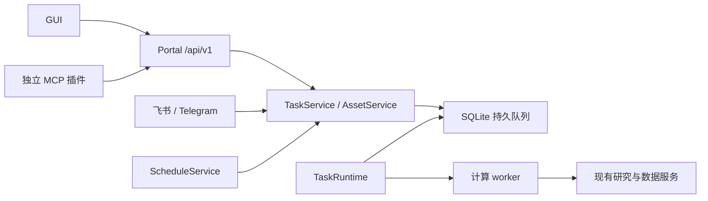

# AlphaPilot Research API v1

本接口供 GUI、独立 MCP 插件和其他 HTTP 客户端连接同一个 AlphaPilot 工作区。MCP 插件可单独建仓库，只依赖 HTTP、凭据和这里发布的 OpenAPI，无须导入 AlphaPilot、Qlib 或 Torch。

## 运行结构



Portal 启动独立的 TaskRuntime。后者持续持有工作区 `runtime.lock`，按持久队列派发独立 worker。浏览器关闭、Portal 重启或 MCP 断连不会取消任务。调度器与通信渠道调用内部服务，不绕行 HTTP。CLI 研究命令仍前台运行，并使用同一资源锁。

任务状态：`queued → starting → running → succeeded / failed`；取消经过 `cancelling → cancelled`，执行丢失为 `lost`。运行时重启接管活着的执行；已开始但无法确认结果的任务不会自动重跑。`starting` 尚未登记执行身份且超时的 attempt 会先失效和清理，再重新排队。

SQLite 保存任务、attempt、幂等键、凭据哈希、资产版本、运行与产物索引、资源锁和调度。日志与输入快照保存在任务目录；结果文件不可变，只有经 attempt 校验、数据库事务发布的结果才对外可见。取消状态不能被迟到结果覆盖。容器以工作区、任务和 attempt 标记，只有确认进程组、子进程和容器全部停止后才释放锁。

## 本地安装与凭据

先按 [迁移说明](migration.md) 升级已有工作区。新工作区可直接使用：

```bash
alphapilot research_token create --client_id=gui --scopes=research:read,research:write,jobs:submit,jobs:cancel,data:write,signals:write,schedules:write
alphapilot research_token create --client_id=mcp --scopes=research:read,research:write,jobs:submit,jobs:cancel
alphapilot portal --host=127.0.0.1
```

创建命令只返回一次明文 `token`。GUI 顶栏“研究服务”输入 GUI 的 Token；刷新页面后需要重新输入，Token 仅保存在内存中。每个客户端使用独立 `client_id`，便于撤销和审计。轮换同一客户端的凭据仍共享其幂等键命名空间。

```bash
alphapilot research_token list
alphapilot research_token revoke --credential_id=凭据ID
alphapilot task_runtime status
alphapilot task_runtime stop
alphapilot task_runtime start
```

`stop` 停止接收新提交和派发，等待执行中的任务结束后退出；排队任务保留到下次 start，不会强杀任务。需要取消的任务先调用取消接口。运行时也可以前台运行：`python -m alphapilot.research.runtime`。

| 权限 | 用途 |
| --- | --- |
| `research:read` | 能力、目录、资产、任务、运行、日志和产物读取 |
| `research:write` | 资产修改、上传/导入、保存挖掘结果、清理研究记录 |
| `jobs:submit` | 提交研究任务 |
| `jobs:cancel` | 取消任务 |
| `data:write` | 数据下载、转换、维护、股票池仪器表同步 |
| `signals:write` | 模拟会话创建、资金调整和 advance |
| `schedules:write` | 创建、修改、触发与暂停研究调度 |

组合操作检查所有涉及权限。自主挖掘会保存策略资产，因此即使不保存因子也要求 `research:write`。日频 preview 使用读取和任务提交权限；advance 额外要求 `signals:write`，刷新行情再要求 `data:write`。调度在创建和触发时都检查授权，凭据被撤销后不再触发。

研究鉴权始终生效，与交易凭据和 Portal 的交易可选鉴权设置相互独立。研究 Token 不赋予券商、下单、配对、文件浏览或服务器管理能力。远程网关只转发 `/api/v1`；不要把整个 Portal 管理面直接作为研究服务暴露。

## HTTP 契约

所有研究请求带 `Authorization: Bearer TOKEN`。独立契约文件：[openapi-v1.json](openapi-v1.json)。运行中可读取 `/api/v1/openapi.json` 和 `/api/v1/capabilities`。能力响应包含可用算法、当前凭据权限、队列、分页、日志、上传和运行时限。

| 接口 | 说明 |
| --- | --- |
| `/datasets`、`/templates`、`/models`、`/factor-dsl` | 服务器登记的资源与 DSL 算子目录 |
| `/factors`、`/strategies`、`/stock-pools` | 有稳定 ID 与 revision 的研究资产 |
| `POST /factors/validate` | 语法、时间语义、规范化表达式、结构化问题、单独的入库准入结果 |
| `POST /jobs` | 强类型 kind/input 联合请求；返回 202 与 Job |
| `/jobs/{id}`、`/logs`、`/result`、`/cancel` | 状态、增量日志、结果、取消 |
| `/runs`、`/runs/{id}` | 所有模式的运行记录，顺序回测保留每次实验 |
| `/artifacts/{id}`、`/content`、`/table`、`/series` | 产物元信息、下载、分页表格与明确标注的降采样曲线 |
| `/uploads` | CSV/JSON/PDF 上传并返回 upload_id，上限 50 MiB |
| `/signal-sessions`、`/schedules` | 日频模拟会话与强类型调度 |
| `/datasets/{id}/symbols`、`/bars` | 分页查询股票与行情 |
| `/commands/plan`、`/commands/dispatch` | GUI 命令计划/派发；仅接收文本，身份由服务端确定 |

列表默认 50、最多 200 条，使用不透明 `next_cursor`；无下一页时为 null。日志游标是字节偏移，每次最多 65536 字节。曲线接口返回原始点数、实际点数和 `downsampled`，指标摘要始终按完整数据计算。交易和持仓是独立表格产物。

`POST /jobs` 必须带 `Idempotency-Key`。同一客户端、同一键和相同请求返回原任务；内容不同返回 409。网络重试必须保留原键；用户改变意图才换键。删除任务记录保留幂等墓碑，不能借删除重用旧键。

```http
POST /api/v1/jobs
Authorization: Bearer TOKEN
Idempotency-Key: backtest-intent-001
Content-Type: application/json

{
  "kind": "factor_backtest",
  "input": {
    "dataset_id": "baostock_cn:day:backward",
    "template_id": "combined",
    "model_id": "lgbm",
    "factor_source": {
      "type": "inline",
      "factors": [{"name": "momentum_10", "expression": "TS_MEAN($close,10)/($close+1e-8)-1"}]
    },
    "mode": "single_ic"
  },
  "budget": {"timeout_seconds": 3600}
}
```

库内引用用 `factor_source: {"type":"library","factor_ids":["ID"]}`，与内联表达式互斥。内联因子无需先入库。验证复用现有 DSL 验证器；“已在库中”不代表表达式不能回测。

参数优先级为显式参数、所选模板参数、服务器默认值。`normalized_input` 返回解析后的参数和入队时因子、策略、股票池快照。行情使用执行开始时的数据版本，并在读取期间锁定、记录指纹；排队期间切换复权模式会让不匹配的任务明确失败。注册模板为 baseline/combined 的参数预设，使用已支持的模型与参数；不接受客户端 Python 类路径、任意 YAML/Pickle 或本机路径。

`Result.availability` 为 `pending / partial / complete / unavailable`。正常完成但没有合格因子也是 complete；失败和取消可能保留已经发布的部分产物。一个 Job 可以有多个 Run，每个运行关联其输入、数据版本、配置与产物。删除任务记录不会删除运行产物或被策略引用的输入快照。

资产导出返回 Artifact，可通过 content_url 下载 v1 JSON 包；格式定义见 [asset-bundles-v1.schema.json](asset-bundles-v1.schema.json)。导入先上传，再将 upload_id 提交到相应资产的 `/import`。策略包携带因子表达式、模型 ID 和回测参数，不携带模型执行状态；导入后标记 requires_retrain，需复测训练后才能建立模拟会话。历史策略缺少数据集标识时，通过 `?dataset_id=目标ID` 选择目标；股票池导入同样要求该参数。逐项导入返回成功数量及各项结构化错误，已有同名资产不会被覆盖。

修改和删除资产必须带 `If-Match: revision`。缺少版本返回 428，版本过期返回 412；客户端重新读取后决定如何处理，不自动覆盖。股票池修改会同步对应数据集的仪器表，因而要求数据写权限。删除后重新创建同名资产会获得新 ID；排队任务不会因名称重用而操作另一个模拟会话。

日频 `preview` 不提交状态。`advance` 按会话和交易日幂等，重复日期返回已提交结果；早于最新日期的推进返回冲突。状态、历史、会话元信息通过可恢复提交日志共同更新，崩溃后读取会先恢复未完成的提交。

## 错误与服务配置

错误结构统一为 `code / message / details / retryable / request_id`。典型错误：

| HTTP | code / 情形 | 客户端处理 |
| --- | --- | --- |
| 401 / 403 | 未认证 / 缺少权限 | 更换有效凭据或调整授予权限 |
| 409 | IDEMPOTENCY_CONFLICT、RESOURCE_BUSY、DATASET_NOT_READY、MIGRATION_REQUIRED | 按 code 解决冲突；只对 retryable=true 自动退避 |
| 410 | API_REMOVED | 升级客户端到 v1 |
| 412 / 428 | VERSION_CONFLICT / PRECONDITION_REQUIRED | 重新读取资产 revision |
| 422 | VALIDATION_ERROR、INVALID_EXPRESSION | 根据 details 修改请求 |
| 429 | QUEUE_FULL | 按 Retry-After 退避，保留原幂等键 |
| 503 | EXECUTION_UNCONFIRMED、运行时排空 | 查询任务和运行时，等待确定结果 |

执行异常位于 Job.error，不会把已接受的长任务转换成同步 HTTP 请求。取消中且存在 EXECUTION_UNCONFIRMED 表示仍在确认进程/容器，资源不会提前释放。

| 环境变量 | 默认 / 说明 |
| --- | --- |
| `ALPHAPILOT_PORTAL_JOB_ROOT` | `git_ignore_folder/portal_jobs`；所有入口必须使用同一绝对目录 |
| `ALPHAPILOT_RESEARCH_MAX_RUNNING` | 1 |
| `ALPHAPILOT_RESEARCH_MAX_QUEUED` | 100 |
| `ALPHAPILOT_RESEARCH_MAX_TIMEOUT` | 86400 秒；单任务默认 3600 秒 |
| `ALPHAPILOT_RESEARCH_AUTOSTART` | 设为 0 可禁止提交时自动启动运行时 |
| `ALPHAPILOT_RESEARCH_CATALOG` | 管理员维护的 JSON 资源登记文件路径 |
| `ALPHAPILOT_RESEARCH_CORS_ORIGINS` | 允许的额外 GUI Origin，逗号分隔；默认同源 |

管理员可以在目录配置的 datasets 中登记 dataset_id、source、freq、adjust_mode、raw_dir、qlib_dir、factor_dir。独立存储的数据集还应显式指定 unadjusted_raw_dir（复权合成使用的不复权 CSV）；配置属于服务器端，公开目录只返回 ID 和可用性等信息。模板登记项包含 template_id、label、template_type、config_name、directory，模板参数白名单来自 BacktestOptions。

数据目录按实际路径加锁，别名指向同一目录仍互斥。共享同一 Qlib 目录的不同复权模式只有最近成功转换的一种 ready。失败写入留下 `.research-dirty.json`，转换或 pipeline 成功后才能恢复可读状态。

## 独立客户端和 MCP 仓库

[http_client.py](../../examples/research/http_client.py) 仅使用 Python 标准库和 HTTP，演示能力发现、提交、查询结果、下载校验。未来 MCP 仓库可复用同一调用顺序：

1. 检查 capabilities 的 API 主版本和授权能力。
2. 工具 `validate_factors` 调用验证接口；`start_mining`、`submit_factor_backtest` 提交后立即返回 job_id。
3. `get_job`、`get_job_result`、`cancel_job` 分别查询/控制同一个工作区任务。
4. 用资源目录提供可选 ID，用产物 ID 获取表格、曲线和文件。

MCP 工具名、描述、协议、stdio/远程传输、安装配置属于独立仓库。业务规则、鉴权、执行与持久化属于 AlphaPilot。新增 MCP 工具通常只需组合已发布的 v1 接口。

修改接口后运行 `python scripts/export_research_contract.py`，同步导出 OpenAPI、资产交换 Schema、前端 TypeScript 和表单 Schema；CI 使用 `--check` 检查契约漂移。离线契约与恢复测试见 `tests/test_research_v1.py`、`tests/test_research_runtime.py`，前端 v1 交互测试位于 `web/src/research.test.tsx` 等文件。

回归命令（在项目对应的 Python 和 Node 环境中执行）：

```bash
python scripts/export_research_contract.py --check
python -m pytest tests/test_research_v1.py tests/test_research_runtime.py tests/test_portal_jobs.py tests/test_portal_openapi_contract.py tests/test_portal_interaction_contract.py
cd alphapilot/modules/portal/web
npm run typecheck
npm test
npm run build
```

浏览器测试使用 `tests/portal_interaction_server.py` 创建独立临时工作区和测试凭据，不连接真实券商。`e2e/portal.spec.ts` 包含外部 HTTP 客户端提交、GUI 取消、同一任务状态一致及图表下载入口检查。可通过 ALPHAPILOT_TEST_PYTHON 指定 Python；没有 ffmpeg 时设 ALPHAPILOT_PLAYWRIGHT_VIDEO=off，仍保留失败截图和 trace。真实模型挖掘测试仅在显式设置 ALPHAPILOT_RUN_REAL_LLM=1 时启用，并要求预先准备已发布数据版本的数据集；可指定 ALPHAPILOT_TEST_DATASET_ID 和 ALPHAPILOT_TEST_POOL_ID。
